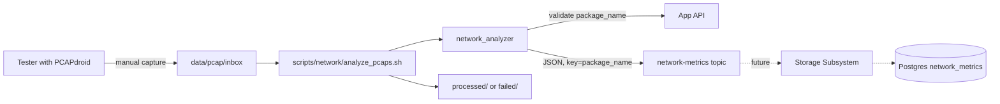

FLAG-o8vlXt7uHzWX4dRuVVfSm0X4

# Network Information Extraction Subsystem

## Architecture decision: Kafka, not direct DB writes

The analyzer publishes to a new `network-metrics` Kafka topic. It never touches Postgres. Rationale (detailed in chat): the storage subsystem requirement explicitly assigns network-metric persistence to itself, and keeping exactly one component holding DB credentials avoids coupling two independently deployed services to one physical schema. The analysis core stays a pure function, which is the main testability win here.



## Kafka message contract

Topic `network-metrics`, key `package_name` (UTF-8), value JSON — mirroring the crawler's snake_case, no-envelope convention in [crawler/kafka_producer.py](crawler/kafka_producer.py):

```json
{
  "analysis_id": "3f9a...-uuid4",
  "package_name": "com.whatsapp",
  "scenario": "UPLOAD",
  "rtt_handshake": 43.12,
  "retransmission_count": 7,
  "zero_window_count": 0,
  "tcp_reset_count": 2,
  "bytes_transferred_total": 18234123,
  "bytes_payload_total": 17540221,
  "overhead_ratio": 0.038,
  "source_pcap_filename": "com.whatsapp__upload__20260907T141500.pcap",
  "analyzed_at": "2026-09-07T14:20:11+00:00"
}
```

Maps 1:1 onto the `network_metrics` table already documented in [docs/raw_md/database_schema.md](docs/raw_md/database_schema.md), with two deliberate deviations to record in the subsystem README:

- `analysis_id` (new): Kafka is at-least-once and the table has no unique constraint, so redelivery would duplicate rows. A UUID per analyzed file, unique-constrained, lets the future consumer `get_or_create`. Re-running a test genuinely yields a new UUID and a new row, preserving the append-only intent.
- `analyzed_at` is stamped by the analyzer and carried in the payload rather than left to `auto_now_add`, so it keeps meaning "when analysis ran" instead of "when the consumer happened to read it".

The analyzer sends `package_name`, not `application_id`. FK resolution is the consumer's job, keeping DB identity out of the analyzer.

## Metric definitions

Exact, no heuristics needed:
- **Zero-window count**: TCP packets with `window == 0`, excluding SYN and RST.
- **TCP reset count**: packets with the RST flag set.
- **Handshake RTT**: mean over all handshakes of `t(SYN-ACK) - t(SYN)`, in ms. Index SYNs by `(src, sport, dst, dport, seq)`; match the SYN-ACK whose `ack == seq + 1` on the reversed tuple. `None` when the capture contains no complete handshake (the schema field is already nullable for exactly this case).

Heuristic, so the definition gets documented explicitly:
- **Retransmission count**: per flow direction, track the highest `seq + payload_len` seen. A segment with `payload_len > 0` whose `seq + payload_len <= max_seen` counts as a retransmission; exact-duplicate SYN and FIN also count. Out-of-order and spurious retransmissions are not distinguished — this is where the tshark oracle test earns its keep.

Volume, with one important design decision:
- **Total bytes transferred**: sum of the **IP total-length field** (`ip.len`, or `payload_len + 40` for IPv6), not the pcap frame length. PCAPdroid defaults to `LINKTYPE_RAW` (101), but with "PCAPdroid extensions" enabled it wraps packets in a fake Ethernet header plus a 28-byte trailer and FCS — roughly 46 bytes per packet of PCAPdroid's own bookkeeping. Summing `ip.len` normalizes across both modes and excludes that synthetic overhead, and is immune to snaplen truncation.
- **Total payload bytes**: TCP → `ip.len - ip_hdr_len - tcp_hdr_len` (options-aware); UDP → `udp.ulen - 8`; everything else → 0.
- **Overhead ratio**: `(total - payload) / total`, guarded at `total == 0`.

Caveat to note in the README: metrics 1–4 are TCP-only while 5–7 cover all IP traffic. Messaging apps lean heavily on QUIC over UDP, so low retransmission and zero-window counts are an expected observation, not a parser bug.

## Module layout

`analysis/` is the pure core — it imports only `models.py`, stdlib, and `dpkt`. No config, no Kafka, no HTTP.

```
network_analyzer/
├── main.py                 # argparse CLI + composition root
├── config.py               # frozen Settings + load_settings() + for_testing()
├── exceptions.py
├── models.py               # Scenario enum, ParsedPacket, NetworkMetrics
├── analyzer_service.py     # use case: validate -> analyze -> publish
├── message_mapper.py       # NetworkMetrics -> Kafka JSON (pure)
├── filename_parser.py      # <package>__<scenario>__<timestamp>.pcap
├── app_registry_client.py  # App API validation
├── kafka_publisher.py      # network-metrics producer
├── analysis/
│   ├── packet_reader.py    # DLT dispatch, trailer strip -> ParsedPacket iterator
│   ├── tcp_analyzer.py     # RTT, retransmissions, zero-window, RST
│   ├── volume_analyzer.py  # total + payload bytes
│   └── metrics_calculator.py
└── tests/
```

`packet_reader.py` reads `reader.datalink()` and handles DLT 101 (raw IP) and DLT 1 (Ethernet). For Ethernet frames it strips the PCAPdroid trailer when the magic `0x01072021` is present at `len - 28`.

Mirrors the crawler's conventions throughout: `from __future__ import annotations`, frozen `@dataclass(slots=True)` settings validated in `__post_init__` raising a subsystem-specific config error, stdlib `logging` configured once in `main.py`, retries via a small `with_retry` helper bound at construction, dependencies wired only in the composition root.

## CLI and file convention

Captures land in `data/pcap/inbox/` named `<package_name>__<upload|download>__<YYYYMMDDTHHMMSS>.pcap`, from which the analyzer derives package and scenario. Both are overridable:

```bash
python -m network_analyzer.main --file data/pcap/inbox/com.whatsapp__upload__20260907T141500.pcap
python -m network_analyzer.main --file capture.pcap --package com.whatsapp --scenario UPLOAD
python -m network_analyzer.main --file capture.pcap --dry-run     # print metrics, publish nothing
```

Before publishing, the service validates via the App API that the package exists, `is_active`, and `is_messaging_app` — so bad input fails locally and immediately rather than surfacing later in a consumer log. `--skip-registry-check` bypasses it for offline work. Publishing awaits delivery acks like the crawler does, so broker failures are synchronous.

## Bash automation

`scripts/network/analyze_pcaps.sh` — batch ingestion over the inbox. Follows [scripts/infra/check_infra.sh](scripts/infra/check_infra.sh) conventions (colored `[OK]`/`[FAIL]` helpers, `.env` sourcing via `set -a`, failure counter, non-zero exit on any failure) but adds `getopts` since it takes arguments: `--inbox DIR`, `--dry-run`, `--keep`, `--help`. Each file is analyzed, then moved to `processed/` on success or `failed/` with a `.log` sidecar on error, giving an idempotent on-disk audit trail with no cron needed.

`scripts/verify/verify_network_metrics.sh` — runs a console consumer against `network-metrics` to confirm messages landed. Needed because the storage subsystem doesn't exist yet, so there are no DB rows to check.

## Testing

Synthetic pcaps built in-process with `scapy.wrpcap` (test-only dependency) carry known ground truth: inject exactly 3 retransmissions, 2 zero-windows, 1 RST, then assert exact numbers. No binary fixtures committed, fully deterministic. Coverage includes both DLT variants and a trailer-bearing capture.

The oracle test compares analyzer output against `tshark -T fields` counts for `tcp.analysis.retransmission` and `tcp.analysis.zero_window` on a generated capture. Marked `@pytest.mark.oracle` and skipped when `tshark` is absent, so it never blocks a normal run. Requires adding an `oracle` marker alongside the existing `live` marker in [pytest.ini](pytest.ini).

## Infra changes

- `network_analyzer/requirements.txt`: `dpkt`, `kafka-python==2.2.15`, `requests==2.32.3`, `python-dotenv==1.0.1`, `pytest==8.3.4`, `scapy`.
- `network_analyzer/Dockerfile`: mirrors the crawler's `python:3.12-slim` + `PYTHONPATH=/app` layout, but with no `CMD` daemon since this is an on-demand batch job.
- [docker-compose.yml](docker-compose.yml): a `network-analyzer` service with `profiles: ["tools"]` so it never starts with `docker compose up`, plus a bind mount for `./data/pcap`. Invoked via `docker compose run --rm network-analyzer`.
- `.gitignore`: exclude `data/pcap/**` (captures are large and may contain personal traffic) while keeping the directory structure via `.gitkeep`.

## Milestones

- **M1 — Skeleton and contract.** Package scaffold, `config.py`, `exceptions.py`, `models.py` with the `Scenario` enum, `filename_parser.py`, and the message contract written into `network_analyzer/README.md`. Verifiable: config and filename-parser tests pass.
- **M2 — Packet reading and volume.** `packet_reader.py` with DLT dispatch and trailer stripping, `volume_analyzer.py`, and the synthetic-pcap test builder. Verifiable: total-bytes and payload-bytes assertions pass on both DLT variants.
- **M3 — TCP analysis.** `tcp_analyzer.py` for all four TCP metrics plus `metrics_calculator.py` producing a complete `NetworkMetrics`. Verifiable: exact-count assertions on synthetic captures, plus the tshark oracle test agreeing.
- **M4 — Publication path.** `app_registry_client.py`, `kafka_publisher.py`, `message_mapper.py`, `analyzer_service.py`. Verifiable: mocked unit tests, plus a `live` round-trip publishing to `network-metrics` and reading it back.
- **M5 — CLI and automation.** `main.py` with argparse and `--dry-run`, `scripts/network/analyze_pcaps.sh`, `scripts/verify/verify_network_metrics.sh`. Verifiable: batch run over a directory of synthetic pcaps sorts files into `processed/` and `failed/` correctly.
- **M6 — Containerization and real capture.** Dockerfile, compose service, `.env.example`, README usage and script documentation. Verifiable: end-to-end run on a genuine PCAPdroid capture from a messaging app in both upload and download scenarios, with the message confirmed in Kafka UI.

M1–M3 need no running infrastructure at all, so the entire analysis core can be built and trusted before any Kafka or App API involvement.
