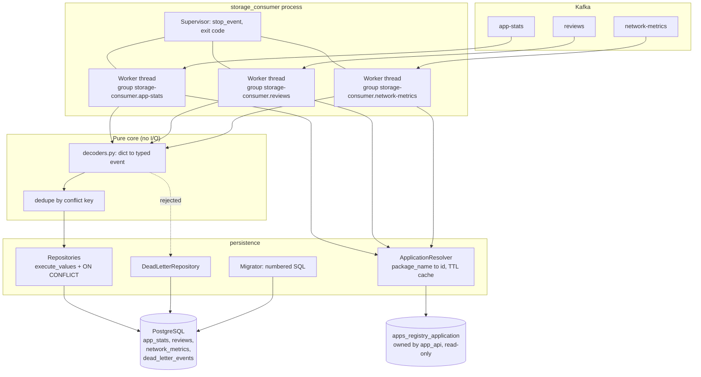

# Storage Consumer Subsystem: Design and Implementation Plan

## 1. What this subsystem is

A long-running daemon that consumes three Kafka topics and persists them to Postgres. It is the only writer of `app_stats`, `reviews`, `network_metrics`, and the only component that reads all three topics.

Inputs, all flat snake_case JSON with `package_name` as the Kafka key (verified against the producers):

- `app-stats` from [crawler/data_mapper.py](crawler/data_mapper.py) — one message per app per hourly cycle. Append-only.
- `reviews` from [crawler/kafka_producer.py](crawler/kafka_producer.py) — **one message per review**, up to 1000 per app per cycle. Upsert on `review_id`.
- `network-metrics` from [network_analyzer/message_mapper.py](network_analyzer/message_mapper.py) — one message per analyzed pcap, on-demand. Insert-once on `analysis_id`.

No envelope, no headers, no schema registry on any topic. The consumer must therefore do its own validation and treat the field sets as the contract.

---

## 2. Concurrency model: the analysis you asked for

### 2.1 First, size the workload

This is the step that decides everything else.

- Volume: at 200 monitored apps, one crawl cycle produces 200 `app-stats` + up to 200,000 `reviews` messages. The crawler parallelises apps (`CRAWLER_MAX_WORKERS`), so the burst compresses into roughly 5-15 minutes: **~300-400 messages/second peak**, near zero between cycles.
- CPU per message: `json.loads` on a ~300-byte document plus field validation is a few tens of microseconds. At 400 msg/s that is well under 2% of one core. There is **no CPU-bound work anywhere in this subsystem**.
- I/O per message: this is the only real cost, and it is entirely controlled by batching. `consumer.poll()` already returns hundreds of records at once. One multi-row `INSERT ... ON CONFLICT` via `psycopg2.extras.execute_values` turns 500 messages into **one** round trip of roughly 15-40 ms.

So a single thread doing poll-batch-write-commit sustains thousands of rows/second, which is two orders of magnitude above the requirement. **Batching, not concurrency, is the performance lever here.** Any concurrency decision must therefore be justified by something other than throughput.

### 2.2 asyncio: rejected

- The concurrency asyncio buys you is *many simultaneous small I/O waits*. After batching we have exactly **one** large I/O wait per cycle (the batch insert). There is nothing to overlap, so the event loop would sit idle waiting on the same single query.
- It forces `aiokafka` + `asyncpg`, diverging from `kafka-python` + `psycopg2` used everywhere else in the repo, doubling the libraries a maintainer must know, and abandoning the `with_retry` helper already established in [crawler/retry_policy.py](crawler/retry_policy.py).
- Kafka's consumer protocol is stateful and awkward under async: `max_poll_interval_ms`, heartbeats, and rebalance callbacks interleaving with `await` points are a well-known source of subtle offset bugs. The synchronous loop is trivially auditable — you can read the code and see that offsets commit after the DB commit.
- Verdict: real added complexity, zero measurable benefit.

### 2.3 multiprocessing: rejected inside the process

Kafka's native unit of parallelism is the **partition**, and its native scaling mechanism is the **consumer group**. If one process ever becomes insufficient, you run a second container replica and Kafka reassigns partitions automatically: no code, no IPC, no shared state, no lifecycle management. Building an intra-process worker pool would reimplement, worse, what the broker gives for free. The GIL argument that normally motivates multiprocessing does not apply because there is no CPU-bound work.

Note the prerequisite: `KAFKA_AUTO_CREATE_TOPICS_ENABLE: "true"` in [docker-compose.yml](docker-compose.yml) creates topics with the broker default of **1 partition**, which caps a consumer group at one active consumer. Topics must be pre-created with several partitions for scale-out to be possible at all. Because the key is `package_name`, per-app ordering survives any partition count.

### 2.4 threading: accepted, but for isolation rather than speed

Use **one thread per topic pipeline** (three threads), each owning its own `KafkaConsumer`, its own `psycopg2` connection, its own consumer group, and its own offsets. The threads share only an immutable `Settings` object and a `threading.Event` stop flag.

Why this is not gratuitous:

- **Head-of-line blocking.** One consumer subscribed to all three topics processes them in a single poll loop, so a 200,000-message reviews burst delays a `network-metrics` message by minutes. Separate pipelines give each topic independent lag.
- **Independent failure domains.** A DB backoff loop triggered by a reviews batch must not stall `app-stats` ingestion.
- **Independent tuning.** Reviews want `max_poll_records=500` for throughput; `network-metrics` wants a small batch for latency.
- **Independent offsets.** Separate consumer groups mean you can reset `reviews` to earliest to rebuild the table without replaying `app-stats`, and you get per-group lag in kafka-ui.

Why it is safe and cheap: `KafkaConsumer` and `psycopg2` connections are both **not** thread-safe, and strict one-per-thread ownership is precisely the documented safe usage. Because the threads share no mutable state there are no locks and no races. The GIL is irrelevant: both `socket.recv` and libpq release it while blocked.

The worker loop is about 40 lines and topic-agnostic. The whole threading cost is a supervisor that starts threads, joins them, and propagates a fatal exit code.

### 2.5 The decision that makes this reversible

`main.py` takes `--pipeline {app-stats,reviews,network-metrics,all}` (default `all`). The identical image therefore deploys either as **one container with three threads** (the compose default, one deploy unit, matching the "one subsystem" framing) or as **three single-threaded containers** with no code change, should you later want independent resource limits and restart policies. The concurrency choice becomes a deployment flag rather than an architectural commitment.

---

## 3. Architecture



Layering rule, mirroring how `network_analyzer/analysis/` is kept free of Kafka and HTTP: `events.py` and `decoders.py` import only stdlib and are pure functions over dicts. Everything I/O-shaped lives in `persistence/` or the Kafka modules. This is what makes the contract testable without a broker or a database.

### 3.1 Module layout

Flat modules plus one `persistence/` subpackage, matching the shape of `network_analyzer`:

- `main.py` — argparse CLI (`run`, `migrate`), composition root, logging, SIGINT/SIGTERM handling
- `config.py` — frozen `@dataclass(slots=True) Settings` + `load_settings()` + `Settings.for_testing()`, copying [crawler/config.py](crawler/config.py)
- `exceptions.py` — `StorageConsumerError` base, plus `ConfigError`, `MessageDecodeError`, `UnknownApplicationError`, `MigrationError`
- `events.py` — frozen DTOs `AppStatsEvent`, `ReviewEvent`, `NetworkMetricEvent`
- `decoders.py` — pure `dict -> DTO`; raises `MessageDecodeError` with a reason string
- `pipelines.py` — `PipelineSpec` (topic, group suffix, decoder, repository, conflict key, tuning) and `build_pipelines(settings)`
- `worker.py` — the topic-agnostic poll/write/commit loop
- `supervisor.py` — thread lifecycle, shared `stop_event`, fatal-error propagation
- `consumer_factory.py` — `KafkaConsumer` construction
- `retry_policy.py` — `with_retry`, intentionally duplicated as documented in [network_analyzer/retry_policy.py](network_analyzer/retry_policy.py)
- `persistence/database.py` — connect, reconnect, `transaction()` context manager
- `persistence/migrator.py` — numbered-SQL runner with advisory lock
- `persistence/application_resolver.py`, `app_stats_repository.py`, `review_repository.py`, `network_metric_repository.py`, `dead_letter_repository.py`
- `persistence/sql/0001_*.sql` ... — the migrations
- `tests/`

---

## 4. The core loop and its ordering guarantee

```python
def run(self) -> None:
    while not self._stop.is_set():
        batches = self._consumer.poll(
            timeout_ms=self._poll_timeout_ms, max_records=self._max_poll_records
        )
        if not batches:
            continue
        records = [r for rs in batches.values() for r in rs]
        outcome = self._write_batch_with_retry(records)  # one DB transaction
        self._consumer.commit()                          # only after DB commit
        logger.info("...", **outcome)
```

```python
def _write_batch(self, records) -> BatchOutcome:
    decoded, rejected = decode_all(records)          # pure, never raises
    with self._db.transaction() as cur:              # BEGIN
        self._dead_letters.record(cur, rejected)
        ids = self._resolver.resolve(cur, {e.package_name for e in decoded})
        rows, unknown = bind_application_ids(decoded, ids)
        self._dead_letters.record(cur, unknown)
        return self._repository.upsert(cur, dedupe_by_key(rows))
                                                     # COMMIT on exit
```

Three properties fall out of this shape:

- **Write before commit.** Offsets advance only after Postgres has durably committed, so nothing is ever lost. This gives at-least-once, and section 5 makes duplicates harmless.
- **One batch is one transaction.** Good rows and dead-letter rows commit atomically, so a crash can never leave a poisoned message recorded-but-unadvanced or advanced-but-unrecorded.
- **No state crosses a poll boundary.** A rebalance mid-batch is automatically safe: the in-flight batch is simply abandoned unwritten and redelivered to whoever gets the partition. This is why no `ConsumerRebalanceListener` bookkeeping is required (one is still added, for logging only).

### 4.1 Consumer configuration

- `enable_auto_commit=False` — non-negotiable. Auto-commit can advance offsets for records not yet written, which is silent data loss.
- `auto_offset_reset="earliest"` — a storage subsystem joining for the first time must ingest what has already been produced, not skip it.
- **No `value_deserializer`.** This is deliberate and easy to get wrong: passing `json.loads` makes `poll()` itself raise on a malformed record, and you cannot then identify or skip it. Keeping raw bytes lets `decoders.py` route the bad record to the dead-letter table and advance past it.
- `max_poll_records` per pipeline: 500 reviews / 200 app-stats / 50 network-metrics.
- `max_poll_interval_ms=300000` — must comfortably exceed worst-case batch time including the DB retry window, or the broker evicts us mid-batch and we livelock on rebalances.
- `session_timeout_ms=45000`, `heartbeat_interval_ms=3000`, `client_id=f"{hostname}:{pipeline}"`.

---

## 5. Idempotency: turning at-least-once into effectively-once

Duplicates are unavoidable (crash between DB commit and offset commit, plus producer-side application-level retries that both [crawler/kafka_producer.py](crawler/kafka_producer.py) and [network_analyzer/kafka_publisher.py](network_analyzer/kafka_publisher.py) document). Every write is therefore made a no-op on redelivery via a natural key:

- `app_stats`: `UNIQUE (application_id, crawled_at)` and `ON CONFLICT DO NOTHING`. `crawled_at` is stamped per message with microsecond precision, one message per app per cycle, so this is naturally unique and only a replay can collide. **This constraint is not in the schema doc and must be added** — without it, replay silently duplicates rows and corrupts every trend chart in Metabase.
- `reviews`: `UNIQUE (review_id)` with `ON CONFLICT (review_id) DO UPDATE ... WHERE EXCLUDED.last_synced_at > reviews.last_synced_at`. The guard clause makes both replay and out-of-order delivery no-ops instead of letting a stale message overwrite fresher data. `first_seen_at` uses `DEFAULT now()` and is never touched on conflict, preserving the semantics in the doc.
- `network_metrics`: `analysis_id UUID NOT NULL UNIQUE` and `ON CONFLICT DO NOTHING`. The producer already generates this UUID per pcap for exactly this purpose ([network_analyzer/README.md](network_analyzer/README.md) lines 93-98). Re-running a test genuinely produces a new UUID and therefore a new row, preserving the append-only intent.
- `dead_letter_events`: `UNIQUE (topic, partition, kafka_offset)` and `ON CONFLICT DO NOTHING` — the coordinates of a Kafka record are its identity.

**In-batch de-duplication is mandatory, not optional.** Postgres raises `ON CONFLICT DO UPDATE command cannot affect row a second time` if the same conflict key appears twice in one multi-row statement. `dedupe_by_key` collapses duplicates within a batch, keeping the highest `crawled_at`. Forgetting this produces a crash loop that only appears under replay.

### 5.1 Why not offsets-in-Postgres for true exactly-once

The alternative is an inbox pattern: store `(topic, partition, offset)` in the same transaction as the data and `seek()` to those offsets on assignment. Rejected because idempotent writes reach the same end state with far less machinery and no fragile seek-on-assign logic — and crucially, `ON CONFLICT` also protects against **producer-side** duplicates, which offset tracking would not catch at all.

---

## 6. Fault tolerance: the error taxonomy

The single most important property is the split between two failure classes, because confusing them is how consumers lose data or wedge forever.

- **Transient — retry the batch, never dead-letter.** `psycopg2.OperationalError`, `InterfaceError`, `DeadlockDetected`, `SerializationFailure`, and `KafkaError` on commit. Bounded exponential backoff via `with_retry`; the connection is re-established on `OperationalError`. Dead-lettering these would discard perfectly good data because the database happened to be restarting.
- **Permanent, per message — dead-letter and advance the offset.** Malformed JSON, missing identity field, wrong type, unparseable timestamp, unknown `scenario`, unknown `package_name`. Retrying these forever blocks the partition permanently; a single bad message would halt all ingestion.
- **Fatal — crash with a non-zero exit code.** Missing config, missing table, unapplied migration, programming error. `restart: unless-stopped` restarts the container and it resumes from the last committed offset. Crash-only recovery is correct precisely because the write path is idempotent.

A worker that exhausts transient retries does **not** die quietly: it sets the shared stop event so the whole process exits non-zero. A half-alive process with two of three pipelines silently dead is the worst possible outcome, so it is designed out.

`dead_letter_events` lives in Postgres rather than a Kafka DLQ topic for two reasons: it commits in the same transaction as the batch (so it cannot be lost while the offset advances), and it is queryable from Metabase and `psql` with no extra tooling.

Graceful shutdown follows the crawler's pattern in [crawler/main.py](crawler/main.py): SIGINT/SIGTERM sets `stop_event`, workers finish the current batch, each closes its consumer (a clean `LeaveGroup` avoids a session-timeout-length rebalance stall) and its connection, then the supervisor joins with a timeout.

---

## 7. Foreign-key resolution

Messages carry `package_name`; the tables need `application_id`.

- One query per batch for all distinct names: `SELECT id, package_name FROM apps_registry_application WHERE package_name = ANY(%s)`, fronted by a per-thread TTL cache (default 300s). Steady state is roughly one query per app per hour. The cache is per-thread, so it needs no lock, consistent with the share-nothing rule.
- Read directly from Postgres, **not** via the App API HTTP endpoint the other two subsystems use. The consumer already holds DB credentials, the lookup is on a unique index, and adding HTTP to the hot write path would add a failure mode for no benefit.
- No filter on `is_active`. Data already produced for an app that was just deactivated should still be stored; activeness is a query-time concern, and the doc is explicit that historical data survives soft delete.
- Unknown `package_name` goes to the dead-letter table rather than blocking the partition.

---

## 8. Schema ownership and migrations

Per your decision: `app_api` keeps owning only `applications` (Django, table `apps_registry_application`); `storage_consumer` owns DDL for the three new tables plus `dead_letter_events`.

Mechanism: numbered `.sql` files under `persistence/sql/`, applied by a ~60-line `migrator.py`. No Alembic — it drags in SQLAlchemy, a large dependency for a project with four tables and no ORM.

- Tracking table `storage_consumer_migrations (version int primary key, name text, applied_at timestamptz default now())`.
- Each file plus its version row applied in **one** transaction, so a failed migration leaves nothing behind.
- `pg_advisory_xact_lock(<constant>)` serialises concurrent replicas, so N containers starting simultaneously is safe.
- Pre-flight check: `to_regclass('apps_registry_application')` must be non-null, otherwise fail with "run `app_api` migrations first" rather than an opaque FK error.
- Container entrypoint runs `migrate` then `run`; `--skip-migrate` is available for operators who prefer to gate DDL manually.
- Boundary to document: nobody must ever add Django models for these three tables, or two tools will fight over the same DDL.

Table names follow the design doc (`app_stats`, `reviews`, `network_metrics`), with FKs to `apps_registry_application(id) ON DELETE CASCADE` and the composite indexes from the doc. The `UNIQUE (application_id, crawled_at)` on `app_stats` provides that table's documented composite index for free.

### 8.1 Deviations from `docs/raw_md/database_schema.md` to reconcile

The doc needs updating alongside the migrations. The nullability principle applied is: **identity and key columns are `NOT NULL` and a missing value dead-letters the message; measurement columns are nullable and a missing value is stored as `NULL`.** A missing measurement is not an invalid record.

- `app_stats`: add `UNIQUE (application_id, crawled_at)` (idempotency, section 5).
- `app_stats.min_installs`: `NOT NULL` becomes nullable — `raw.get("minInstalls")` legitimately yields `None` for new apps, and one absent metric should not discard the whole stats row.
- `reviews.score`: `NOT NULL` becomes nullable, same reasoning (`raw.get("score")` can be `None`).
- `reviews.last_synced_at`: sourced from the message's `crawled_at` rather than `auto_now`. This is what makes the monotonic replay guard possible, and it is also the more honest semantics — it records when the data was synced from Play Store, not when our row was touched.
- `network_metrics`: add `analysis_id UUID NOT NULL UNIQUE`, already anticipated by the analyzer's README.
- New table `dead_letter_events (id, topic, partition, kafka_offset, kafka_key, raw_payload BYTEA, error_reason TEXT, occurred_at, UNIQUE(topic, partition, kafka_offset))`.

### 8.2 Timestamp handling, a concrete trap

`crawled_at`, `app_updated_at`, and `analyzed_at` all arrive with a UTC offset. But `reviews.at` often does **not**: `google-play-scraper` returns naive datetimes and [crawler/playstore_client.py](crawler/playstore_client.py) calls `.isoformat()` on them, so the wire value can be `"2026-09-01T10:00:00"` with no offset. Policy: parse with `datetime.fromisoformat`, and if the result is naive, attach UTC and log at DEBUG. Columns are `TIMESTAMPTZ`. Without this the column silently mixes offset-aware and offset-naive interpretations.

---

## 9. Configuration

Frozen dataclass + `os.getenv` + `python-dotenv`, exactly as the other two subsystems do — not pydantic-settings.

- Required: `KAFKA_BOOTSTRAP_SERVERS`, and `POSTGRES_DB` / `POSTGRES_USER` / `POSTGRES_PASSWORD` / `POSTGRES_HOST` / `POSTGRES_PORT` (reusing the names already in [.env.example](.env.example) and `app_api/.env.example` rather than inventing new ones).
- Optional, `STORAGE_` prefix: `STORAGE_PIPELINES`, `STORAGE_CONSUMER_GROUP_PREFIX` (default `storage-consumer`), `STORAGE_POLL_TIMEOUT_MS`, `STORAGE_MAX_POLL_RECORDS`, `STORAGE_MAX_POLL_INTERVAL_MS`, `STORAGE_AUTO_OFFSET_RESET`, `STORAGE_DB_RETRY_MAX_ATTEMPTS`, `STORAGE_DB_RETRY_BASE_DELAY_SECONDS`, `STORAGE_DB_STATEMENT_TIMEOUT_MS`, `STORAGE_APPLICATION_CACHE_TTL_SECONDS`, `STORAGE_SHUTDOWN_TIMEOUT_SECONDS`.
- Session-level `statement_timeout` and `idle_in_transaction_session_timeout` are set on connect so a hung write cannot block a pipeline forever; `application_name` is set to `storage_consumer:<pipeline>` for `pg_stat_activity` visibility.
- `requirements.txt`: `kafka-python==2.2.15`, `psycopg2-binary==2.9.12` (matching the `app_api` pin), `python-dotenv==1.0.1`, `pytest==8.3.4`.

---

## 10. Observability

- One INFO line per non-empty batch: pipeline, partitions, offset range, decoded / inserted / updated / skipped / dead-lettered, duration_ms. Insert-versus-update is distinguished with `RETURNING (xmax = 0) AS inserted`, so the log answers "is this backfill or steady state" at a glance.
- Consumer lag per group is already visible in the existing kafka-ui service.
- Liveness: each worker touches a heartbeat file; a small `scripts/healthcheck.sh` checks mtime freshness for the compose `healthcheck`. No HTTP server, no new dependency.

---

## 11. Testing strategy

Matching repo convention: `unittest.TestCase` bodies run under pytest, mocks for Kafka, no `conftest.py`.

- **Contract tests** on `decoders.py`, mirroring `network_analyzer/tests/test_message_mapper.py`: assert the exact accepted field set per topic, that every documented-nullable field survives as `None`, and that each missing identity field produces `MessageDecodeError`. These are the tests that catch a producer changing a field name.
- **Worker loop tests** with a fake consumer and fake repository. The two that matter most: *offsets are not committed when the DB write raises*, and *a transient DB error retries the batch rather than dead-lettering it*.
- **Unit tests** for `dedupe_by_key`, the naive-datetime policy, and resolver cache hit/miss/TTL behaviour.
- **Integration tests** against compose Postgres and Kafka under a new `integration` marker in [pytest.ini](pytest.ini). The decisive one: produce a batch, consume it, record row counts, rewind the consumer group offsets to earliest, consume again, and assert row counts are **identical**. That single test is the proof that the idempotency design works.
- `scripts/verify/verify_storage_consumer.sh`, mirroring `scripts/verify/verify_network_metrics.sh`, for manual end-to-end checks.

---

## 12. Stages and milestones

### M0 — Schema foundation
Migration runner, the four `.sql` files, pre-flight check for `apps_registry_application`, `migrate` CLI subcommand, and the reconciling edits to [docs/raw_md/database_schema.md](docs/raw_md/database_schema.md) covering section 8.1.
*Done when:* `python -m storage_consumer.main migrate` creates all four tables with every constraint and index on a fresh compose Postgres, is idempotent on re-run, and fails with a clear message if Django has not migrated yet.

### M1 — Pure core
`config.py`, `exceptions.py`, `events.py`, `decoders.py`, `retry_policy.py`, plus the full contract test suite.
*Done when:* contract tests pass with no broker and no database, and every field of all three wire schemas is covered including nullability and the naive-datetime case.

### M2 — Persistence layer
`database.py`, `application_resolver.py`, the three repositories, `dead_letter_repository.py`, `dedupe_by_key`.
*Done when:* integration tests show insert-then-replay leaves row counts unchanged for all three tables, the reviews monotonic guard rejects a stale update, and `first_seen_at` survives an upsert.

### M3 — Kafka worker, end to end on one topic
`consumer_factory.py`, `worker.py`, `supervisor.py`, `main.py` with signals and `--pipeline`, wired for `app-stats` only.
*Done when:* the crawler's real `app-stats` messages land in `app_stats`; killing the process mid-run and restarting loses nothing and duplicates nothing; SIGTERM shuts down cleanly.

### M4 — Remaining pipelines
`reviews` and `network-metrics` pipelines, per-pipeline tuning, three threads under the supervisor.
*Done when:* a full crawl cycle (`app-stats` + 1000 reviews/app) plus a concurrent `network-metrics` message all persist correctly, and the reviews burst demonstrably does not delay the network-metrics pipeline.

### M5 — Packaging and operations
`Dockerfile`, `docker-entrypoint.sh` (migrate then run), the `storage-consumer` service in [docker-compose.yml](docker-compose.yml), `.env.example`, `README.md`, `scripts/verify/verify_storage_consumer.sh`, and pre-creating the three topics with multiple partitions.
*Done when:* `docker compose up -d` brings up a working consumer from a clean state with no manual steps.

### M6 — Hardening
Heartbeat file plus compose `healthcheck`, dead-letter operational runbook, batch-metrics log review, and a load test at 10x expected volume to validate the single-thread-per-pipeline sizing assumption in section 2.1.
*Done when:* the throughput headroom is measured rather than asserted, and dead-letter handling has a documented recovery procedure.

---

## 13. Deferred, with rationale

- **`applications.display_name` / `category` backfill** — out of scope per your decision. The gap is real: the schema doc says the crawler fills these when empty, but the `app-stats` payload in [crawler/data_mapper.py](crawler/data_mapper.py) contains no such fields, so no consumer could do it today. It will be noted in the docs as a known gap requiring a crawler-side payload change.
- **`sentiment` column population** — the column is created by M0 as documented, left `NULL`, and owned by the future `sentiment/` subsystem.
- **Multi-replica scale-out** — enabled by M5's partition pre-creation and the `--pipeline` flag, but not exercised; single-container is far more than sufficient at expected volume.