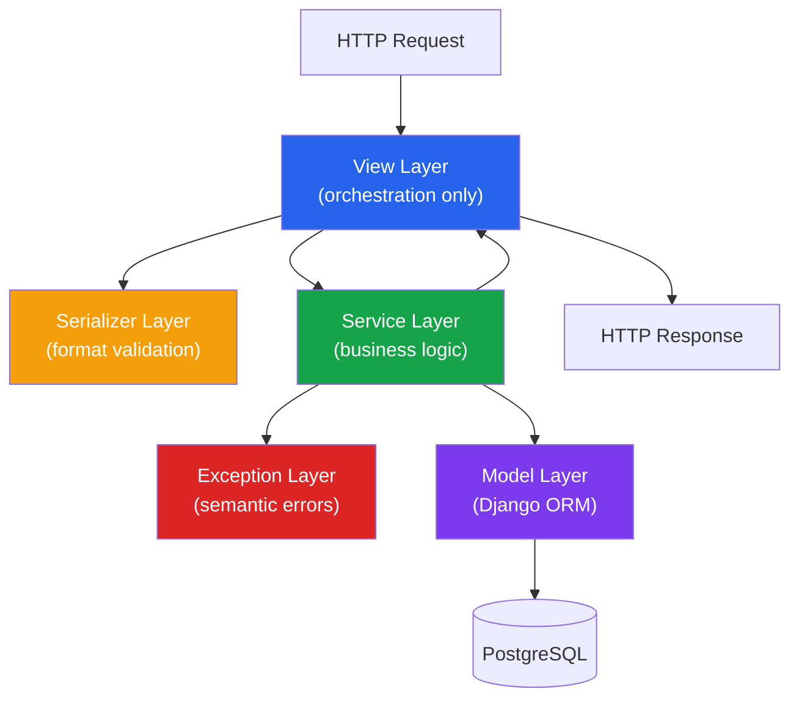
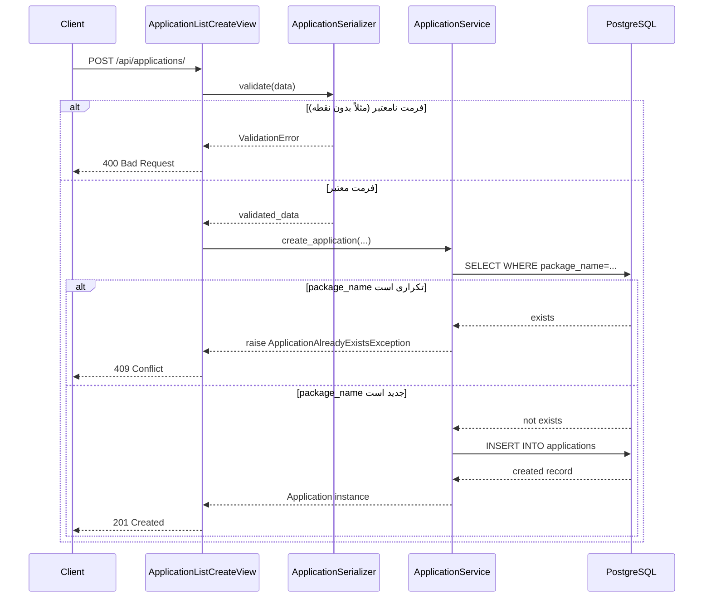
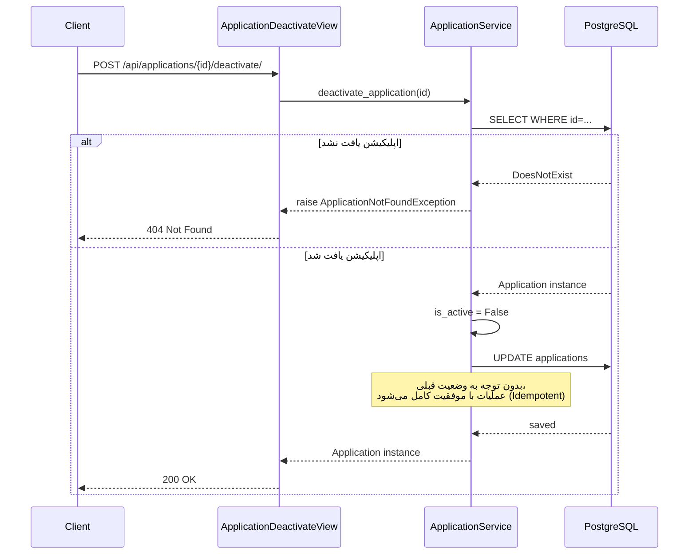
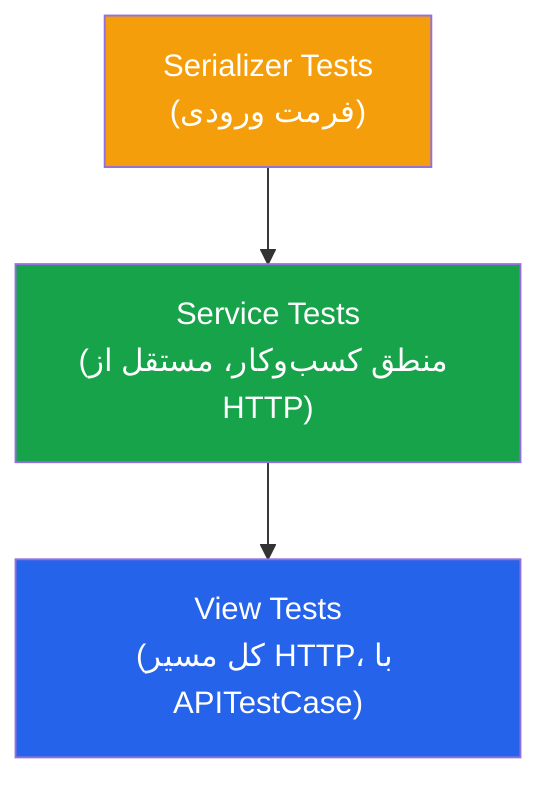

<h1>زیرسیستم ذخیره لیست اپلیکیشن‌ها (Application Registry)</h1>

این مستند معماری، فلوی درخواست‌ها، و تصمیمات مهندسی زیرسیستم مدیریت لیست اپلیکیشن‌ها را که با <b>Django REST Framework</b> پیاده‌سازی شده، شرح می‌دهد. این زیرسیستم مسئول عملیات Create/Read/Update/Deactivate روی فهرست اپلیکیشن‌های تحت پایش پروژه است و به‌عنوان منبع حقیقت (Source of Truth) برای زیرسیستم کراولر عمل می‌کند.

<h2>۱. معماری لایه‌ای</h2>

به‌جای نوشتن منطق کسب‌وکار مستقیم داخل View ها (اشتباه رایج در پروژه‌های Django)، این زیرسیستم بر اساس یک <b>معماری لایه‌ای سبک</b> طراحی شده که مسئولیت‌ها را طبق اصل Single Responsibility Principle جدا می‌کند.

<table dir="rtl" align="right" style="width:100%; text-align:right; border-collapse:collapse;" border="1">
<tr>
<th>لایه</th>
<th>مسئولیت</th>
<th>چرا جدا شده</th>
</tr>
<tr>
<td><b>View</b></td>
<td>دریافت Request، صدا زدن Service، بازگرداندن Response</td>
<td>هیچ تصمیم کسب‌وکاری در این لایه گرفته نمی‌شود؛ فقط Orchestration خالص HTTP</td>
</tr>
<tr>
<td><b>Serializer</b></td>
<td>اعتبارسنجی فرمت ورودی (مثل فرمت package_name)</td>
<td>قوانین فرمت داده از قوانین کسب‌وکار (مثل یکتایی) جدا شده‌اند</td>
</tr>
<tr>
<td><b>Service</b></td>
<td>منطق کسب‌وکار (یکتایی، Soft Delete، تغییرناپذیری package_name)</td>
<td>قابل استفاده مستقل از HTTP؛ مثلاً از CLI یا Celery هم قابل فراخوانی است</td>
</tr>
<tr>
<td><b>Exception</b></td>
<td>خطاهای دامنه با معنای مشخص (AlreadyExists, NotFound, Invalid)</td>
<td>جایگزین خطاهای عمومی و بی‌معنی؛ توسط Handler مرکزی به کد HTTP مناسب map می‌شود</td>
</tr>
<tr>
<td><b>Model</b></td>
<td>تعریف ساختار داده و ارتباط با پایگاه‌داده</td>
<td>تنها لایه‌ای که مستقیماً با ORM/دیتابیس در ارتباط است</td>
</tr>
</table>

<h2>۲. فلوی درخواست: ساخت اپلیکیشن جدید (Create)</h2>

این دیاگرام دقیق‌ترین مسیر یک درخواست را در سیستم نشان می‌دهد — از لحظه‌ی ورود Request تا برگشت Response، شامل مسیر شکست (خطا) در صورت تکراری بودن.

<h2>۳. فلوی درخواست: غیرفعال‌سازی اپلیکیشن (Deactivate)</h2>

این عملیات به‌صورت <b>Idempotent</b> طراحی شده است — یعنی فراخوانی مکرر آن روی یک اپ از قبل غیرفعال، همچنان با موفقیت (نه خطا) پاسخ می‌دهد. این تصمیم آگاهانه از اصول طراحی REST پیروی می‌کند.

<h2>۴. نقشه‌ی کامل Endpoint ها</h2>

<table dir="rtl" align="right" style="width:100%; text-align:right; border-collapse:collapse;" border="1">
<tr>
<th>Method</th>
<th>مسیر</th>
<th>عملکرد</th>
<th>کدهای پاسخ</th>
</tr>
<tr>
<td>GET</td>
<td><code>/api/applications/</code></td>
<td>لیست اپلیکیشن‌ها، با فیلتر اختیاری (is_active, is_messaging_app, category)</td>
<td>200</td>
</tr>
<tr>
<td>POST</td>
<td><code>/api/applications/</code></td>
<td>ساخت اپلیکیشن جدید</td>
<td>201, 400, 409</td>
</tr>
<tr>
<td>GET</td>
<td><code>/api/applications/{id}/</code></td>
<td>دریافت جزئیات یک اپلیکیشن</td>
<td>200, 404</td>
</tr>
<tr>
<td>PATCH / PUT</td>
<td><code>/api/applications/{id}/</code></td>
<td>ویرایش اپلیکیشن (package_name غیرقابل‌تغییر است)</td>
<td>200, 400, 404</td>
</tr>
<tr>
<td>POST</td>
<td><code>/api/applications/{id}/deactivate/</code></td>
<td>غیرفعال‌سازی (Soft Delete، Idempotent)</td>
<td>200, 404</td>
</tr>
<tr>
<td>POST</td>
<td><code>/api/applications/{id}/reactivate/</code></td>
<td>فعال‌سازی مجدد (Idempotent)</td>
<td>200, 404</td>
</tr>
</table>

مستندات تعاملی و کامل این Endpoint ها به‌صورت خودکار (Swagger/OpenAPI) در آدرس <code>/swagger/</code> در دسترس است و شامل نمونه‌ی Request/Response برای هر عملیات می‌باشد.

<h2>۵. تصمیمات کلیدی طراحی</h2>

<ul>
<li><b>Soft Delete به‌جای حذف فیزیکی:</b> عملیات «حذف» در واقع فقط پرچم <code>is_active</code> را <code>False</code> می‌کند. این تصمیم مستقیماً از نیازمندی سند پروژه («غیرفعال کردن اپلیکیشن») گرفته شده و تضمین می‌کند داده‌های تاریخی (ریویوها، آمار) هرگز از دست نروند.</li>

<li><b>Idempotent بودن Deactivate/Reactivate:</b> فراخوانی مکرر این عملیات‌ها خطا تولید نمی‌کند، طبق بهترین‌شیوه‌های طراحی REST API؛ کلاینت نیازی به بررسی وضعیت فعلی قبل از فراخوانی ندارد.</li>

<li><b>تغییرناپذیری package_name:</b> این فیلد شناسه‌ی ارجاعی تمام زیرسیستم‌های دیگر (کراولر، صف پیام) است؛ به همین دلیل پس از ساخت اولیه غیرقابل‌تغییر است. این قانون هم در Serializer (فیلد read-only در ویرایش) و هم در Service (بررسی صریح) اعمال شده — دفاع دو لایه‌ای در برابر خطای انسانی یا برنامه‌نویسی.</li>

<li><b>مدیریت خطای دامنه به‌صورت مرکزی:</b> به‌جای تکرار <code>try/except</code> در هر View، خطاهای دامنه (<code>ApplicationAlreadyExistsException</code>, <code>ApplicationNotFoundException</code>, ...) توسط یک Exception Handler مرکزی به کد HTTP مناسب (409، 404، 400) نگاشت می‌شوند. این معماری از اصل DRY و Open/Closed Principle پیروی می‌کند: افزودن خطای جدید نیازی به تغییر View های موجود ندارد.</li>

<li><b>عدم استفاده از Dependency Injection کلاسیک:</b> این یک تصمیم آگاهانه است، نه کمبود. Django ذاتاً بر پایه‌ی الگوی Active Record ساخته شده و DI کامل (تزریق Repository به‌جای دسترسی مستقیم ORM) در این مقیاس هزینه‌ی مهندسی بیشتری نسبت به فایده‌اش دارد؛ به‌خصوص که استراتژی تست این پروژه بر پایه‌ی Integration Test با دیتابیس واقعی است، نه Unit Test کاملاً مجزا با Mock.</li>
</ul>

<h2>۶. استراتژی تست</h2>

تست‌ها مطابق اصل Test Pyramid، از پایین‌ترین لایه به بالاترین لایه نوشته شده‌اند تا هم سرعت اجرا و هم پوشش کامل مسیر HTTP تضمین شود.

<table dir="rtl" align="right" style="width:100%; text-align:right; border-collapse:collapse;" border="1">
<tr>
<th>لایه‌ی تست</th>
<th>نمونه سناریوهای پوشش‌داده‌شده</th>
</tr>
<tr>
<td>Serializer</td>
<td>فرمت نامعتبر package_name (بدون نقطه، فاصله‌دار، نقطه‌ی ابتدایی/انتهایی)، display_name فقط‌فاصله</td>
</tr>
<tr>
<td>Service</td>
<td>ساخت موفق/تکراری، فیلتر بر اساس وضعیت و دسته، تغییرناپذیری package_name، رفتار Idempotent در Deactivate/Reactivate، چرخه‌ی کامل حیات یک اپلیکیشن</td>
</tr>
<tr>
<td>View</td>
<td>کدهای وضعیت HTTP صحیح برای هر سناریو (۲۰۰، ۲۰۱، ۴۰۰، ۴۰۴، ۴۰۹)، فیلتر از طریق Query Parameter</td>
</tr>
</table>

<h2>۷. ابزارها و تکنولوژی‌های استفاده‌شده</h2>

<table dir="rtl" align="right" style="width:100%; text-align:right; border-collapse:collapse;" border="1">
<tr>
<th>ابزار</th>
<th>نقش</th>
</tr>
<tr>
<td>Django + Django REST Framework</td>
<td>فریم‌ورک اصلی و لایه‌ی API</td>
</tr>
<tr>
<td>PostgreSQL</td>
<td>پایگاه‌داده‌ی رابطه‌ای</td>
</tr>
<tr>
<td>drf-yasg</td>
<td>تولید خودکار مستندات Swagger/OpenAPI</td>
</tr>
<tr>
<td>Django TestCase / DRF APITestCase</td>
<td>تست‌های Unit و Integration</td>
</tr>
<tr>
<td>python-dotenv</td>
<td>مدیریت پیکربندی محیطی (env variables)</td>
</tr>
</table>

این زیرسیستم به‌عنوان اولین ماژول کاملاً پیاده‌سازی‌شده‌ی پروژه، پایه‌ی الگوی معماری (Service Layer + Exception Handling مرکزی) را برای زیرسیستم‌های بعدی (کراولر، تحلیل شبکه) نیز فراهم می‌کند.

