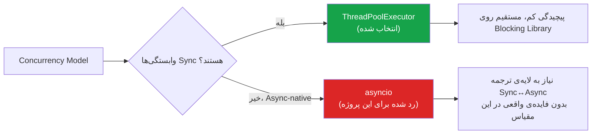
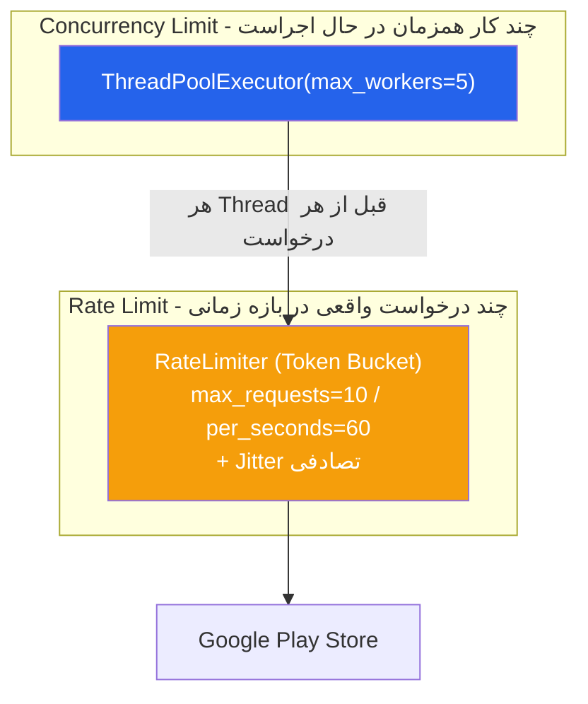
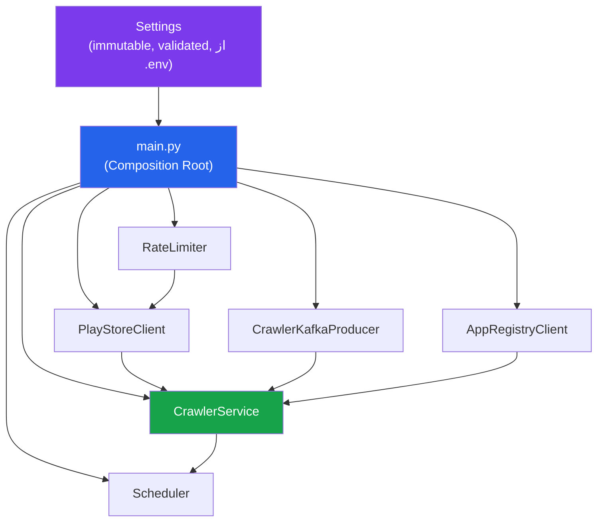
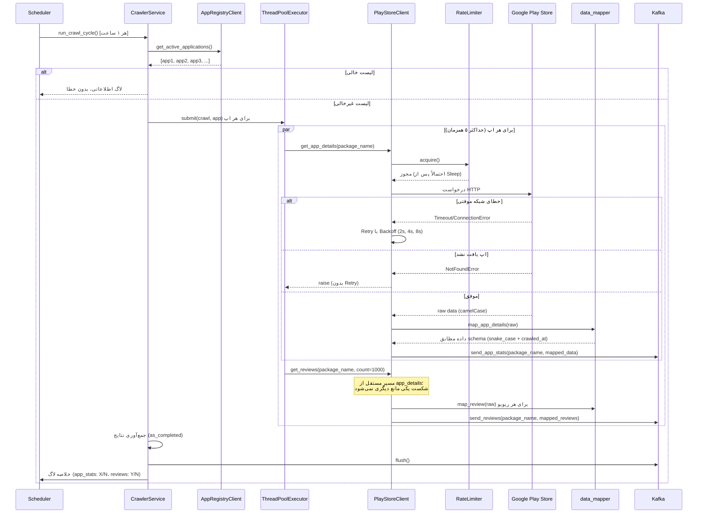
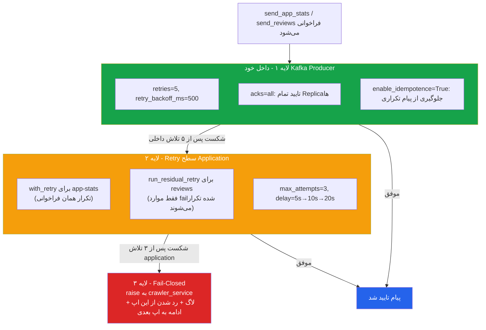
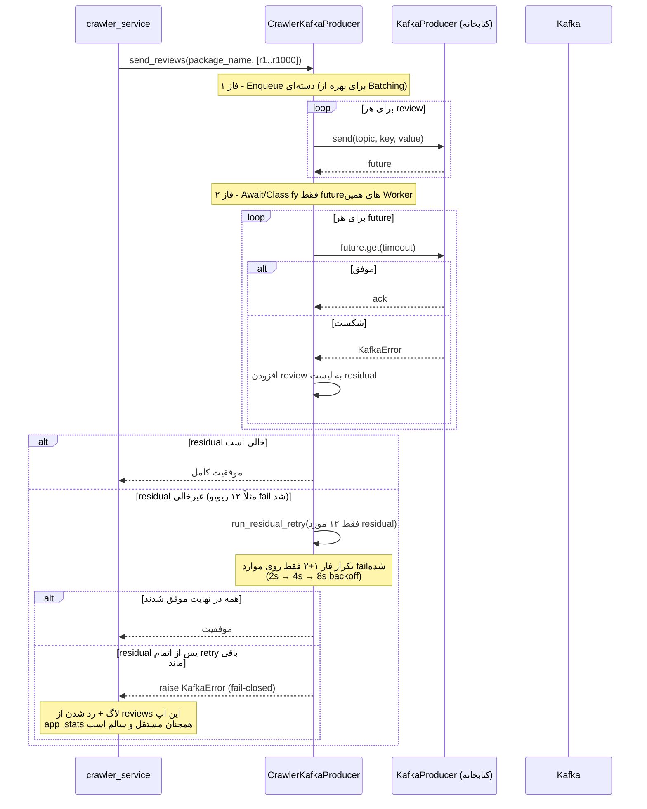
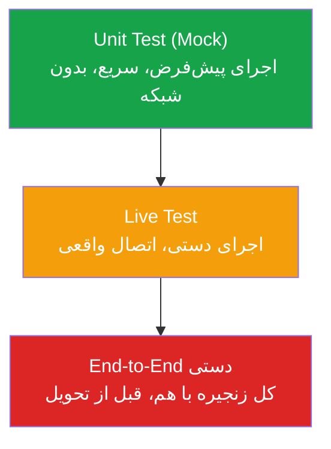

<b>زیرسیستم خزش Play Store (Crawler)</b>

 

این مستند معماری، فلوی اجرا، و تصمیمات مهندسی زیرسیستم خزش Play Store را شرح می‌دهد. این زیرسیستم مسئول استخراج دوره‌ای (هر ۱ ساعت) آمار کلی و نقدهای هر اپلیکیشن فعال، و انتشار آن‌ها به Kafka برای مصرف توسط Storage Consumer است.

<b>۱. تصمیم معماری کلیدی: چرا Threading و نه Asyncio؟</b>

 

با اینکه این کار ذاتاً I/O-Bound است (بیشتر زمان صرف انتظار برای پاسخ شبکه می‌شود، نه پردازش)، که معمولاً محیط مناسبی برای <code>asyncio</code> است، این تصمیم عمداً گرفته نشد. دلیل: تمام وابستگی‌های این زیرسیستم — کتابخانه‌ی <code>google-play-scraper</code>، کتابخانه‌ی Kafka، و کتابخانه‌ی HTTP برای ارتباط با App Registry — به‌صورت Synchronous (Blocking) هستند. افزودن <code>asyncio</code> روی چنین پشته‌ای، فقط یک لایه‌ی مدیریتی اضافه می‌کند بدون فایده‌ی واقعی، در حالی که <code>ThreadPoolExecutor</code> مستقیماً و با پیچیدگی به‌مراتب کمتر همان کنترل همزمانی را فراهم می‌کند.

<b>۲. تفکیک دو مفهوم: Concurrency Limit در برابر Rate Limit</b>

 

این دو مفهوم عمداً با دو مکانیزم کاملاً مستقل پیاده‌سازی شده‌اند تا نقش هرکدام شفاف بماند.

<table dir="rtl" align="right" style="width:100%; text-align:right; border-collapse:collapse;" border="1">
<tr>
<th>مکانیزم</th>
<th>سوالی که پاسخ می‌دهد</th>
<th>پیاده‌سازی</th>
</tr>
<tr>
<td>Concurrency Limit</td>
<td>چند اپ همزمان در حال پردازش‌اند؟</td>
<td><code>ThreadPoolExecutor(max_workers=5)</code></td>
</tr>
<tr>
<td>Rate Limit</td>
<td>در هر دقیقه چند درخواست واقعی به Play Store می‌رود؟</td>
<td><code>RateLimiter</code> با الگوی Token Bucket، Thread-safe (با Lock)، با Jitter تصادفی برای جلوگیری از الگوی درخواست کاملاً منظم</td>
</tr>
<tr>
<td>Retry</td>
<td>در صورت خطای موقتی شبکه چه باید کرد؟</td>
<td>Exponential Backoff (2s → 4s → 8s)، محدود به خطاهای واقعاً موقتی (<code>RequestException</code>)؛ <code>NotFoundError</code> هرگز Retry نمی‌شود</td>
</tr>
</table>

<b>۳. معماری لایه‌ای و تزریق وابستگی (Dependency Injection)</b>

 

برخلاف زیرسیستم App API (که بر پایه‌ی Active Record جنگو است)، این زیرسیستم از کلاس‌های پایتون خالص تشکیل شده که وابستگی‌هایشان از بیرون (Constructor) تزریق می‌شود. این تصمیم مستقیماً از استراتژی تست این زیرسیستم ناشی می‌شود: تمام تست‌ها با Mock کامل (بدون اتصال واقعی) نوشته شده‌اند، و DI دقیقاً همان مکانیزمی است که این جایگزینی را ممکن می‌سازد.

<code>main.py</code> تنها جایی در کل زیرسیستم است که تمام اشیاء واقعی ساخته و به‌هم متصل می‌شوند (Composition Root). تمام تنظیمات (Rate Limit، Retry، تعداد Worker، بازه‌ی زمانی کراول) از یک کلاس <code>Settings</code> واحد و Immutable خوانده می‌شوند که در ابتدای اجرا Validate می‌شود — یعنی مقدار نامعتبر محیطی (مثل عدد منفی) بلافاصله در لحظه‌ی شروع برنامه با خطای واضح متوقف می‌شود، نه ساعت‌ها بعد وسط یک دور کراول.

<b>۴. فلوی کامل یک دور کراول</b>

<b>۵. قرارداد داده: از کتابخانه تا پایگاه‌داده</b>

 

داده‌ی خام کتابخانه (camelCase، بدون timestamp کراول) هرگز مستقیم به Kafka فرستاده نمی‌شود. یک لایه‌ی <code>data_mapper</code> مستقل، آن را به دقیقاً همان ساختار مورد انتظار جدول‌های پایگاه‌داده (طبق طراحی اسکیما) تبدیل می‌کند. این تصمیم Kafka را از فرمت داخلی یک کتابخانه‌ی خارجی مستقل نگه می‌دارد.

<table dir="rtl" align="right" style="width:100%; text-align:right; border-collapse:collapse;" border="1">
<tr>
<th>خروجی خام کتابخانه</th>
<th>پیام نهایی در Kafka</th>
<th>دلیل تبدیل</th>
</tr>
<tr>
<td><code>minInstalls</code>, <code>adSupported</code>, ...</td>
<td><code>min_installs</code>, <code>ad_supported</code>, ...</td>
<td>سازگاری با نام‌گذاری snake_case جدول‌های Postgres (camelCase بدون کوتیشن در Postgres به‌صورت خودکار lowercase و غیرقابل‌خواندن می‌شود)</td>
</tr>
<tr>
<td><code>updated</code> (Unix Timestamp عددی)</td>
<td><code>app_updated_at</code> (رشته ISO 8601)</td>
<td>تطابق مستقیم با نوع DateTime ستون در جدول <code>app_stats</code></td>
</tr>
<tr>
<td>— (وجود ندارد)</td>
<td><code>crawled_at</code> (رشته ISO 8601، تولید‌شده در لحظه‌ی دریافت)</td>
<td>نیازمندی صریح سند پروژه: هر رکورد باید با timestamp لحظه‌ی خزش ثبت شود</td>
</tr>
</table>

<b>۶. استراتژی سه‌لایه‌ی Retry برای انتشار پیام در Kafka</b>

 

نسخه‌ی اولیه‌ی Producer، پیام را فقط در بافر می‌گذاشت و تنها در پایان کل چرخه یک <code>flush</code> کلی انجام می‌داد — یعنی خطای تحویل یک پیام خاص، اغلب دیر یا حتی بی‌صدا دیده می‌شد. برای رفع این مشکل، انتشار پیام به سه لایه‌ی مستقل و مکمل تقسیم شد تا هیچ داده‌ای که با موفقیت از Play Store گرفته شده، به‌خاطر یک قطعی موقتی Kafka از دست نرود.

<table dir="rtl" align="right" style="width:100%; text-align:right; border-collapse:collapse;" border="1">
<tr>
<th>پارامتر</th>
<th>مقدار</th>
<th>چرا این مقدار</th>
</tr>
<tr>
<td><code>kafka_producer_retries</code></td>
<td>5</td>
<td>لایه‌ی داخلی ارزان‌ترین جای Retry است (بدون تاخیر طولانی)؛ فرصت کافی به کتابخانه داده می‌شود تا مشکلات لحظه‌ای (چند میلی‌ثانیه‌ای) را خودش حل کند، پیش از ارجاع به لایه‌ی گران‌تر</td>
</tr>
<tr>
<td><code>kafka_producer_retry_backoff_ms</code></td>
<td>500</td>
<td>مقدار پیش‌فرض استاندارد در اکوسیستم Kafka (سازگار با <code>librdkafka</code> و اکثر کلاینت‌های رسمی)؛ به‌اندازه‌ی کافی کوتاه که ۵ تلاش کل بیش از چند ثانیه طول نکشد</td>
</tr>
<tr>
<td><code>kafka_producer_acks</code></td>
<td>all</td>
<td>تنها گزینه‌ای که Durability واقعی تضمین می‌کند (منتظر تایید تمام Replicaهای هماهنگ)؛ کندتر از <code>acks=1</code> ولی چون فرکانس ارسال پایین است (چند ده پیام در ساعت، نه هزاران در ثانیه)، این هزینه در برابر تضمین از‌دست‌نرفتن داده کاملاً توجیه‌پذیر است</td>
</tr>
<tr>
<td><code>kafka_producer_enable_idempotence</code></td>
<td>True</td>
<td>وقتی Retry داخلی فعال است، بدون این گزینه خطر واقعی ثبت پیام تکراری (Duplicate) در Kafka وجود دارد؛ فعال‌سازی آن عملاً هزینه‌ی منفی ندارد</td>
</tr>
<tr>
<td><code>kafka_producer_request_timeout_ms</code></td>
<td>5000</td>
<td>تعادل بین تحمل نوسان طبیعی شبکه و جلوگیری از قفل ماندن طولانی یک Worker Thread از سقف محدود (۵ Thread) Concurrency</td>
</tr>
<tr>
<td><code>kafka_producer_delivery_timeout_ms</code></td>
<td>15000</td>
<td>سقف زمانی کل مسیر یک پیام شامل تمام تلاش‌های داخلی؛ تضمین می‌کند حتی در بدترین حالت لایه‌ی ۱، پیام در یک زمان معقول (نه بی‌نهایت) به لایه‌ی ۲ ارجاع داده شود</td>
</tr>
<tr>
<td><code>kafka_send_retry_max_attempts</code></td>
<td>3</td>
<td>رسیدن به این لایه یعنی کل بودجه‌ی لایه‌ی داخلی از قبل شکست خورده — نشانه‌ی یک مشکل جدی‌تر؛ به همین دلیل کمتر از ۵ تلاش لایه‌ی اول، هم‌راستا با الگوی <code>PlayStoreClient</code></td>
</tr>
<tr>
<td><code>kafka_send_retry_base_delay_seconds</code></td>
<td>5.0</td>
<td>بزرگ‌تر از تاخیر پایه‌ی Play Store (۲ ثانیه) چون مشکل در این نقطه جدی‌تر فرض می‌شود؛ صبر بیشتر پیش از تلاش مجدد، به‌جای فشار اضافه به سیستمی که احتمالاً از قبل تحت فشار است</td>
</tr>
</table>

<b>۷. فلوی دقیق ارسال ریویوها: Batch-Confirm با Residual Retry</b>

 

برای ارسال ~۱۰۰۰ ریویوی هر اپ، یک راهکار دو-فاز طراحی شده تا هم بهینگی Batch حفظ شود و هم فقط پیام‌های واقعاً ناموفق دوباره ارسال شوند (نه کل دسته).

نکته‌ی کلیدی این طراحی: به‌جای <code>flush()</code> مشترک روی کل Producer (که خطای یک Worker را می‌توانست به‌اشتباه به اپ Worker دیگری نسبت دهد)، هر Worker فقط روی <code>future</code>های مربوط به فراخوانی خودش <code>get</code> می‌زند — یعنی Attribution خطا همیشه دقیق و مختص همان اپ باقی می‌ماند.

<b>۸. استراتژی تست</b>

<table dir="rtl" align="right" style="width:100%; text-align:right; border-collapse:collapse;" border="1">
<tr>
<th>لایه</th>
<th>مثال</th>
<th>دلیل جداسازی</th>
</tr>
<tr>
<td>Unit Test (Mock)</td>
<td>آیا <code>get_app_details</code> فیلدها را درست فیلتر می‌کند؟ آیا Retry دقیقاً ۳ بار تلاش می‌کند؟</td>
<td>سریع (کل مجموعه زیر ۲ ثانیه)، قطعی (بدون وابستگی به وضعیت اینترنت)، تکرارپذیر برای سناریوهای خطا</td>
</tr>
<tr>
<td>Live Test (<code>pytest -m live</code>)</td>
<td>آیا اتصال واقعی به Google Play/Kafka همان ساختاری را برمی‌گرداند که در Mock فرض کرده‌ایم؟</td>
<td>اعتبارسنجی فرض‌های Mock در برابر دنیای واقعی؛ اجرای دستی و کم‌دفعه برای جلوگیری از Rate Limit روی خودمان</td>
</tr>
<tr>
<td>End-to-End دستی</td>
<td>اجرای کامل <code>main.py</code> با زیرساخت واقعی و بررسی پیام‌های نهایی در Kafka</td>
<td>تنها راه تایید این‌که تمام اجزا (نه فقط هرکدام جدا) واقعاً با هم کار می‌کنند</td>
</tr>
</table>

<b>۷. تصمیمات کلیدی دیگر</b>

 

<ul>

<li><b>یک پیام Kafka به‌ازای هر ریویو (نه یک پیام حاوی لیست کامل):</b> این تصمیم Storage Consumer آینده را ساده نگه می‌دارد — هر پیام مستقل قابل ingestion، Upsert بر اساس <code>review_id</code>، Replay، و اعتبارسنجی است، بدون نیاز به منطق باز کردن دسته (Batch-unpacking).</li>
 

<li><b>مدیریت مستقل خطای app_stats و reviews برای هر اپ:</b> این دو مسیر در یک Thread مشترک (برای استفاده‌ی بهینه از همان Rate Limiter) اجرا می‌شوند، اما هرکدام <code>try/except</code> جداگانه دارند. شکست در گرفتن ریویوها هرگز مانع ارسال موفق آمار کلی همان اپ (و برعکس) نمی‌شود.</li>
 

<li><b>پیکربندی Immutable و Fail-Fast (<code>Settings</code>):</b> تمام مقادیر پیکربندی (Rate Limit، Retry، تعداد Worker، ...) در یک کلاس <code>dataclass(frozen=True)</code> واحد جمع شده‌اند که در <code>__post_init__</code> اعتبارسنجی می‌شود. این تضمین می‌کند مقدار محیطی نامعتبر، بلافاصله در لحظه‌ی شروع (نه ساعت‌ها بعد) برنامه را متوقف کند.</li>
 

<li><b>جداسازی <code>.env</code> محیط توسعه از مقادیر Docker:</b> فایل <code>crawler/.env</code> فقط برای اجرای مستقل (venv) روی هاست است (مثلاً <code>KAFKA_BOOTSTRAP_SERVERS=localhost:9092</code>)؛ در <code>docker-compose.yml</code> این مقادیر مستقیماً و جداگانه به آدرس‌های داخلی شبکه‌ی داکر (<code>kafka:29092</code>) تنظیم می‌شوند، چون این دو محیط اجرا نیازمند آدرس‌دهی متفاوتی هستند.</li>

</ul>

<b>۸. ابزارها و تکنولوژی‌های استفاده‌شده</b>

 

<table dir="rtl" align="right" style="width:100%; text-align:right; border-collapse:collapse;" border="1">
<tr>
<th>ابزار</th>
<th>نقش</th>
</tr>
<tr>
<td>google-play-scraper</td>
<td>استخراج آمار کلی و نقدهای اپلیکیشن از Play Store</td>
</tr>
<tr>
<td>ThreadPoolExecutor (concurrent.futures)</td>
<td>اجرای همزمان کراول چند اپلیکیشن با سقف مشخص</td>
</tr>
<tr>
<td>kafka-python</td>
<td>انتشار پیام‌های آمار و نقد به Kafka</td>
</tr>
<tr>
<td>APScheduler (BlockingScheduler)</td>
<td>اجرای خودکار و دوره‌ای (هر ۱ ساعت) چرخه‌ی کراول</td>
</tr>
<tr>
<td>requests</td>
<td>ارتباط HTTP با App Registry API برای دریافت لیست اپلیکیشن‌های فعال</td>
</tr>
<tr>
<td>python-dotenv</td>
<td>بارگذاری پیکربندی محیطی در حالت توسعه (venv)</td>
</tr>
</table>

