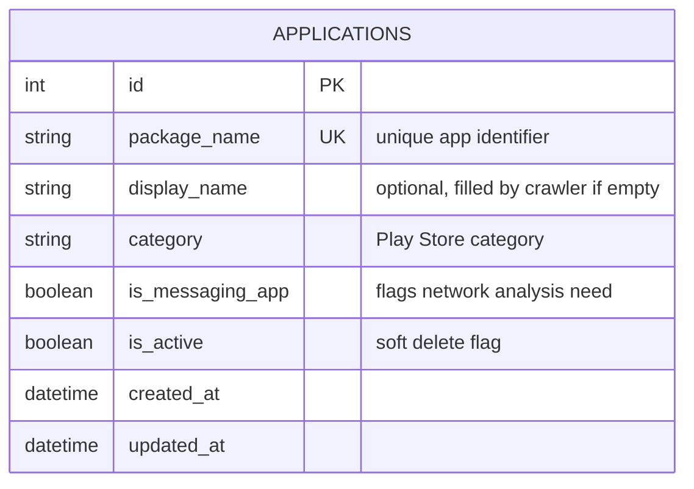
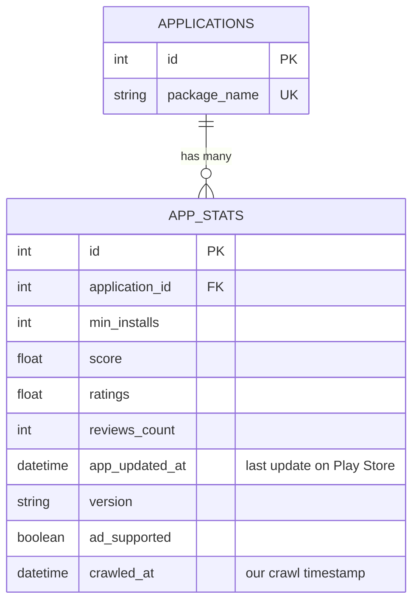
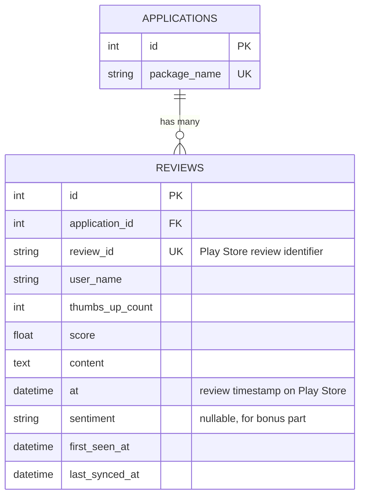
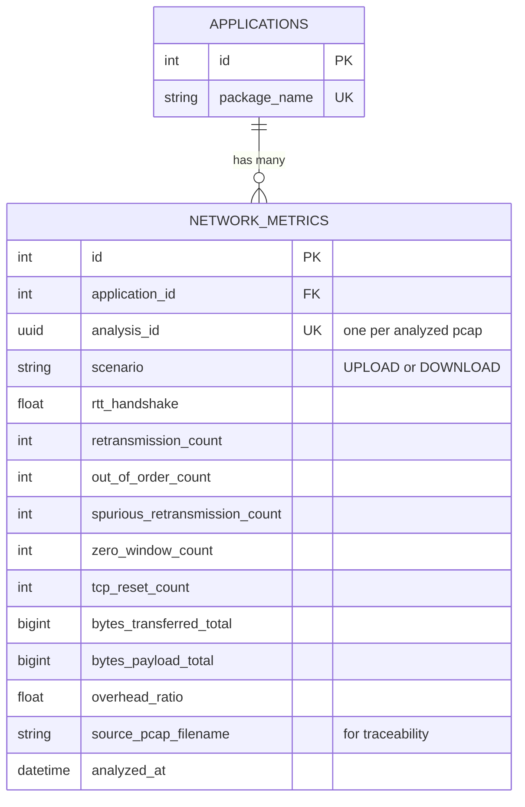

<b>طراحی پایگاه‌داده پروژه</b>

 

این سند اسکیمای جدول‌های پایگاه‌داده‌ی پروژه و منطق طراحی هر یک را مستند می‌کند. جدول‌ها به‌مرور که پروژه پیش می‌رود تکمیل خواهند شد.

<b>۱. جدول Applications</b>

 

جدول مرکزی سیستم است که فهرست اپلیکیشن‌های تحت پایش را نگه می‌دارد. این جدول تنها <b>وضعیت فعلی لیست اپلیکیشن‌ها</b> را نمایش می‌دهد و شامل داده‌های آماری یا تاریخچه‌ای نیست؛ آن داده‌ها در جدول‌های جداگانه (app_stats، reviews، network_metrics) نگهداری می‌شوند تا هر بار کراول، رکورد جدید ایجاد شود بدون آنکه وضعیت لیست اپلیکیشن‌ها دستکاری شود.

<b>دیاگرام (ER)</b>

<b>مشخصات فیلدها</b>

 

<table dir="rtl" align="right" style="width:100%; text-align:right; border-collapse:collapse;" border="1">
<tr>
<th>فیلد</th>
<th>نوع داده</th>
<th>ویژگی‌ها</th>
<th>توضیح و دلیل طراحی</th>
</tr>

<tr>
<td><code>id</code></td>
<td>Integer</td>
<td>Primary Key, Auto Increment</td>
<td>کلید داخلی استاندارد جهت ارجاع سریع در روابط FK.</td>
</tr>

<tr>
<td><code>package_name</code></td>
<td>CharField(255)</td>
<td>Unique, Not Null, Indexed</td>
<td>شناسه‌ی یکتای اپ در Google Play (مثل com.whatsapp). چون سایر زیرسیستم‌ها (کراولر، تحلیل شبکه) بر اساس همین مقدار به اپ ارجاع می‌دهند نه id داخلی، Unique و Indexed بودن آن برای جلوگیری از رکورد تکراری و سرعت جست‌وجو ضروری است.</td>
</tr>

<tr>
<td><code>display_name</code></td>
<td>CharField(255)</td>
<td>Nullable</td>
<td>نام نمایشی اپ. اختیاری در نظر گرفته شده تا فرآیند Create ساده بماند (کاربر فقط package_name را وارد کند)؛ در صورت خالی بودن، در اولین اجرای کراولر از Play Store استخراج و تکمیل می‌شود.</td>
</tr>

<tr>
<td><code>category</code></td>
<td>CharField(100)</td>
<td>Nullable</td>
<td>دسته‌بندی رسمی اپ طبق Google Play، برای گزارش‌گیری‌های کلی در Metabase (مثل مقایسه‌ی امتیاز بر اساس دسته).</td>
</tr>

<tr>
<td><code>is_messaging_app</code></td>
<td>Boolean</td>
<td>Default: False</td>
<td>فلگ عملیاتی مجزا از category که مشخص می‌کند آیا این اپ نیازمند جمع‌آوری داده‌ی شبکه‌ای (pcap) است یا نه. جدا نگه‌داشتن آن از category باعث می‌شود منطق زیرسیستم شبکه با یک بررسی Boolean ساده انجام شود، بدون نیاز به مقایسه‌ی رشته‌ای روی مقدار دسته‌بندی.</td>
</tr>

<tr>
<td><code>is_active</code></td>
<td>Boolean</td>
<td>Default: True</td>
<td>پیاده‌سازی حذف نرم (Soft Delete) طبق نیازمندی API چهارم («غیرفعال کردن اپلیکیشن»، نه حذف فیزیکی). کراولر فقط رکوردهایی با is_active = True را پردازش می‌کند و داده‌ی تاریخی اپ‌های غیرفعال‌شده نیز دست‌نخورده باقی می‌ماند.</td>
</tr>

<tr>
<td><code>created_at</code></td>
<td>DateTime</td>
<td>Auto (auto_now_add)</td>
<td>زمان ثبت اولیه‌ی اپ در سیستم؛ برای Audit و بررسی روند رشد لیست.</td>
</tr>

<tr>
<td><code>updated_at</code></td>
<td>DateTime</td>
<td>Auto (auto_now)</td>
<td>زمان آخرین ویرایش رکورد لیست (نه داده‌ی آماری)؛ برای دیباگ و ردیابی تغییرات API چهارم (Update).</td>
</tr>

</table>

 

<b>تصمیمات طراحی</b>

 

<ul>
<li><b>جداسازی وضعیت از تاریخچه:</b> این جدول عمداً هیچ فیلد آماری (امتیاز، تعداد نصب و ...) ندارد. علت آن است که این مقادیر در طول زمان تغییر می‌کنند و هدف پروژه تحلیل روند تغییرات آن‌هاست؛ نگه‌داری‌شان در همین جدول به معنای از دست دادن تاریخچه در هر Update خواهد بود. به همین دلیل این داده‌ها به جدول جداگانه‌ی app_stats که هر بار کراول یک رکورد جدید در آن درج می‌شود، منتقل شده‌اند.</li>
 
<li><b>Soft Delete به‌جای حذف واقعی:</b> چون سند صراحتاً واژه‌ی «غیرفعال کردن» را برای عملیات Delete به‌کار برده، حذف فیزیکی رکورد صحیح نیست؛ داده‌های تاریخی مرتبط با اپ (ریویوها، آمار قبلی) باید حتی پس از غیرفعال شدن اپ در پایگاه‌داده باقی بمانند.</li>
 
<li><b>package_name به‌جای id به‌عنوان کلید ارجاع بین‌سیستمی:</b> از آنجا که کراولر و زیرسیستم شبکه به‌صورت مستقل با اپ‌ها کار می‌کنند، استفاده از یک شناسه‌ی معنادار و پایدار (package_name) به‌جای کلید داخلی auto-increment، افزونگی و خطای انسانی در تطبیق داده را کاهش می‌دهد.</li>
</ul>

<b>۲. جدول App Stats</b>

 

این جدول آمار کلی هر اپلیکیشن را که هر یک ساعت یک‌بار توسط زیرسیستم کراولر استخراج می‌شود، نگهداری می‌کند. برخلاف جدول applications که فقط وضعیت فعلی را نشان می‌دهد، این جدول ماهیت <b>Append-Only</b> دارد؛ یعنی هر بار کراول، به‌جای بازنویسی رکورد قبلی، یک رکورد جدید درج می‌شود تا امکان تحلیل روند تغییرات آماری در طول زمان (طبق نیازمندی بخش تحلیل داده) فراهم بماند.

<b>دیاگرام (ER)</b>

<b>مشخصات فیلدها</b>

 

<table dir="rtl" align="right" style="width:100%; text-align:right; border-collapse:collapse;" border="1">
<tr>
<th>فیلد</th>
<th>نوع داده</th>
<th>ویژگی‌ها</th>
<th>توضیح و دلیل طراحی</th>
</tr>

<tr>
<td><code>id</code></td>
<td>Integer</td>
<td>Primary Key, Auto Increment</td>
<td>کلید داخلی رکورد آماری. چون هر کراول یک رکورد جدید می‌سازد (نه Update)، این جدول به‌سرعت رشد می‌کند و id مستقل از application لازم است.</td>
</tr>

<tr>
<td><code>application</code></td>
<td>ForeignKey</td>
<td>Not Null, on_delete=CASCADE, Indexed</td>
<td>ارجاع به رکورد اپ در جدول applications. از CASCADE استفاده شده چون داده‌ی آماری بدون وجود اپ مادر بی‌معنی است؛ به‌طور خودکار توسط Django ایندکس می‌شود.</td>
</tr>

<tr>
<td><code>min_installs</code></td>
<td>BigInteger</td>
<td>Nullable</td>
<td>حداقل تعداد نصب اعلام‌شده در Play Store. از BigInteger استفاده شده چون اپ‌های پرنصب می‌توانند اعداد بزرگ‌تر از محدوده‌ی Integer معمولی داشته باشند. <b>تغییر نسبت به طرح اولیه:</b> این فیلد از Not Null به Nullable تبدیل شد، چون Play Store برای اپ‌های تازه‌منتشرشده این مقدار را برنمی‌گرداند و پیام Kafka آن را به‌صورت <code>null</code> حمل می‌کند؛ اصل حاکم بر Nullability این است که «فیلدهای هویتی و کلیدی Not Null هستند و نبودشان باعث رد پیام می‌شود، اما فیلدهای سنجشی Nullable هستند و نبودشان به‌صورت NULL ذخیره می‌شود». نبودِ یک سنجه نباید کل رکورد آماری را دور بیندازد.</td>
</tr>

<tr>
<td><code>score</code></td>
<td>Float</td>
<td>Nullable</td>
<td>امتیاز کلی اپ (عددی اعشاری مثل 4.3). Nullable در نظر گرفته شده چون اپ‌های تازه‌منتشرشده ممکن است هنوز امتیازی نداشته باشند.</td>
</tr>

<tr>
<td><code>ratings</code></td>
<td>BigInteger</td>
<td>Nullable</td>
<td>تعداد کل رتبه‌بندی‌های ثبت‌شده برای اپ.</td>
</tr>

<tr>
<td><code>reviews_count</code></td>
<td>BigInteger</td>
<td>Nullable</td>
<td>تعداد کل نقدهای نوشته‌شده برای اپ (متفاوت از تعداد نقدهایی که ما ذخیره می‌کنیم؛ این عدد از سمت Play Store گزارش می‌شود).</td>
</tr>

<tr>
<td><code>version</code></td>
<td>CharField(50)</td>
<td>Nullable</td>
<td>نسخه‌ی فعلی اپ. برخی اپ‌ها این مقدار را افشا نمی‌کنند، به همین دلیل Nullable است.</td>
</tr>

<tr>
<td><code>ad_supported</code></td>
<td>Boolean</td>
<td>Nullable</td>
<td>مشخص می‌کند آیا اپ از تبلیغات پشتیبانی می‌کند یا نه.</td>
</tr>

<tr>
<td><code>app_updated_at</code></td>
<td>DateTime</td>
<td>Nullable</td>
<td>زمانی که خودِ اپلیکیشن در Play Store آخرین‌بار به‌روزرسانی شده است. این فیلد <b>عمداً</b> از crawled_at جدا نگه‌داشته شده تا «زمان تغییر واقعی اپ» با «زمان ثبت داده توسط ما» قاطی نشود.</td>
</tr>

<tr>
<td><code>crawled_at</code></td>
<td>DateTime</td>
<td>Not Null, Indexed, عضو <code>UNIQUE (application_id, crawled_at)</code></td>
<td>زمان دقیقی که ما این رکورد را کراول کرده‌ایم. طبق سند، مبنای اصلی تحلیل روند در Metabase همین فیلد است؛ به همراه application در یک ایندکس مرکب قرار می‌گیرد. این فیلد در پیام Kafka با دقت میکروثانیه مهر می‌شود و به‌ازای هر اپ در هر چرخه فقط یک پیام تولید می‌گردد، بنابراین به‌طور طبیعی یکتا است و تنها یک بازپخش (replay) می‌تواند با آن تصادم کند.</td>
</tr>

</table>

 

<b>تصمیمات طراحی</b>

 

<ul>
<li><b>ماهیت Append-Only:</b> این جدول هرگز رکورد موجود را Update نمی‌کند؛ هر اجرای کراولر یک ردیف جدید اضافه می‌کند. این تصمیم مستقیماً از نیاز پروژه به «تحلیل تغییرات آمار در گذر زمان» ناشی می‌شود؛ اگر رکورد بازنویسی می‌شد، امکان رسم نمودار Trend نصب‌ها یا امتیاز از بین می‌رفت.</li>
 
<li><b>ایندکس مرکب (application_id, crawled_at):</b> پرتکرارترین کوئری روی این جدول، هم از سمت Storage Consumer (بررسی آخرین رکورد ثبت‌شده برای یک اپ) و هم از سمت Metabase (رسم روند یک اپ خاص در طول زمان)، به‌صورت «فیلتر بر اساس اپ + مرتب‌سازی بر اساس زمان» است. برخلاف جدول applications که حجم کمی دارد، این جدول با نرخ (تعداد اپ × هر ساعت) رشد می‌کند و بدون این ایندکس، کوئری‌ها با گذشت زمان کند خواهند شد. این ایندکس به‌صورت رایگان از محدودیت Unique بند بعدی به دست می‌آید و نیازی به ساختن ایندکس جداگانه نیست.</li>
 
<li><b>محدودیت <code>UNIQUE (application_id, crawled_at)</code> (افزوده‌شده در زیرسیستم Storage Consumer):</b> تحویل پیام در Kafka از نوع at-least-once است و هر دو producer پروژه در سطح اپلیکیشن نیز تلاش مجدد (retry) انجام می‌دهند؛ بنابراین یک پیام می‌تواند بیش از یک‌بار به دست مصرف‌کننده برسد. بدون این محدودیت، هر بازپخش بی‌صدا رکورد تکراری می‌سازد و تمام نمودارهای روند در Metabase را خراب می‌کند. با وجود آن، مصرف‌کننده می‌تواند از <code>ON CONFLICT DO NOTHING</code> استفاده کند و تحویل تکراری بی‌اثر شود. توجه شود که این محدودیت با ماهیت Append-Only جدول در تضاد نیست: هر چرخه‌ی کراول واقعی، <code>crawled_at</code> تازه‌ای دارد و رکورد جدید می‌سازد.</li>
 
<li><b>جداسازی app_updated_at از crawled_at:</b> این دو مفهوم متفاوت‌اند و قاطی کردنشان باعث تحلیل غلط می‌شود؛ یکی «چه زمانی اپ تغییر کرده» و دیگری «چه زمانی ما این تغییر را مشاهده کرده‌ایم» را نشان می‌دهد.</li>
<li><b>on_delete=CASCADE به‌جای SET_NULL:</b> از آنجا که هدف پروژه Soft Delete در سطح applications است (نه حذف فیزیکی)، در عمل هرگز نباید یک application واقعاً حذف شود؛ CASCADE صرفاً برای یکپارچگی داده در سناریوهای غیرمنتظره (مثل پاک‌سازی دستی در توسعه) در نظر گرفته شده است.</li>
</ul>

<b>۳. جدول Reviews</b>

 

این جدول نقدهای کاربران را برای هر اپلیکیشن نگهداری می‌کند. برخلاف دو جدول قبلی، این جدول ماهیت <b>Upsert</b> دارد؛ طبق نیازمندی صریح سند، داده‌ها باید بر اساس فیلد review_id پس از هر بار دریافت اطلاعات جدید به‌روزرسانی شوند، نه اینکه در هر کراول رکورد تکراری ایجاد شود. این تفاوت اساسی با جدول app_stats (که Append-Only بود) باید در سطح Unique Constraint روی review_id اعمال شود.

<b>دیاگرام (ER)</b>

<b>مشخصات فیلدها</b>

 

<table dir="rtl" align="right" style="width:100%; text-align:right; border-collapse:collapse;" border="1">
<tr>
<th>فیلد</th>
<th>نوع داده</th>
<th>ویژگی‌ها</th>
<th>توضیح و دلیل طراحی</th>
</tr>

<tr>
<td><code>id</code></td>
<td>Integer</td>
<td>Primary Key, Auto Increment</td>
<td>کلید داخلی رکورد. با اینکه review_id شناسه‌ی معنادار است، برای سازگاری با روابط FK احتمالی آینده و کارایی بهتر Join، یک PK عددی مجزا نگه داشته می‌شود.</td>
</tr>

<tr>
<td><code>application</code></td>
<td>ForeignKey</td>
<td>Not Null, on_delete=CASCADE, Indexed</td>
<td>ارجاع به اپ مربوطه در applications. به‌طور خودکار توسط Django ایندکس می‌شود و در ایندکس مرکب زیر نیز استفاده می‌گردد.</td>
</tr>

<tr>
<td><code>review_id</code></td>
<td>CharField(255)</td>
<td><b>Unique</b>, Not Null, Indexed</td>
<td>شناسه‌ی یکتای نقد در Play Store. این فیلد ستون کلیدی برای عملیات Upsert است: پیش از درج، سیستم بر اساس این مقدار بررسی می‌کند که رکورد از قبل وجود دارد یا خیر.</td>
</tr>

<tr>
<td><code>user_name</code></td>
<td>CharField(255)</td>
<td>Nullable</td>
<td>نام کاربری نویسنده‌ی نقد. برخی کاربران این مقدار را در Play Store مخفی می‌کنند، بنابراین Nullable در نظر گرفته شده است.</td>
</tr>

<tr>
<td><code>thumbs_up_count</code></td>
<td>Integer</td>
<td>Default: 0</td>
<td>تعداد موافقت با نقد. این مقدار می‌تواند در طول زمان تغییر کند، به همین دلیل باید در هر Sync به‌روزرسانی شود؛ دلیل اصلی نیاز پروژه به Upsert همین فیلد است.</td>
</tr>

<tr>
<td><code>score</code></td>
<td>SmallInteger</td>
<td>Nullable</td>
<td>امتیاز داده‌شده در همان نقد (عددی بین ۱ تا ۵). از SmallInteger استفاده شده چون بازه‌ی مقدار محدود و مشخص است. <b>تغییر نسبت به طرح اولیه:</b> از Not Null به Nullable تبدیل شد، به همان دلیلی که در <code>app_stats.min_installs</code> توضیح داده شد؛ نبودِ این مقدار در پاسخ Play Store نباید باعث دور انداختن متن نقد شود.</td>
</tr>

<tr>
<td><code>content</code></td>
<td>TextField</td>
<td>Nullable</td>
<td>متن نقد. از TextField (نه CharField) استفاده شده چون طول متن نامحدود و متغیر است؛ Nullable چون برخی کاربران فقط امتیاز می‌دهند بدون نوشتن متن.</td>
</tr>

<tr>
<td><code>at</code></td>
<td>DateTime</td>
<td>Not Null, Indexed</td>
<td>زمانی که کاربر نقد را در Play Store ثبت کرده است. مبنای اصلی تحلیل روند امتیاز نقدها در طول زمان در Metabase.</td>
</tr>

<tr>
<td><code>sentiment</code></td>
<td>CharField(20)</td>
<td>Nullable, Choices: POSITIVE / NEUTRAL / NEGATIVE</td>
<td>نتیجه‌ی تحلیل احساسات متن نقد (بخش امتیازی پروژه). از همین مرحله اضافه شده تا در پیاده‌سازی بخش Sentiment Analysis نیازی به تغییر ساختاری جدول نباشد؛ Nullable است چون تا پیش از اجرای آن ماژول مقداردهی نمی‌شود.</td>
</tr>

<tr>
<td><code>first_seen_at</code></td>
<td>DateTime</td>
<td>Auto (auto_now_add)</td>
<td>اولین باری که این نقد توسط سیستم دیده و ذخیره شده است. این مقدار هرگز تغییر نمی‌کند، حتی اگر رکورد بعداً Upsert شود.</td>
</tr>

<tr>
<td><code>last_synced_at</code></td>
<td>DateTime</td>
<td>Not Null، از <code>crawled_at</code> پیام</td>
<td>آخرین باری که این رکورد از Play Store همگام‌سازی شده است. با هر Upsert به‌روز می‌شود و مشخص می‌کند آیا یک نقد اخیراً تغییر کرده (مثلاً افزایش thumbs_up_count) یا نه. <b>تغییر نسبت به طرح اولیه:</b> مقدار آن از فیلد <code>crawled_at</code> همان پیام Kafka گرفته می‌شود، نه از <code>auto_now</code>. این هم معنای صادقانه‌تری دارد (زمان همگام‌سازی داده از Play Store، نه زمان دست خوردن ردیف ما) و هم پیش‌نیاز نگهبان یکنوای (monotonic guard) بند «تصمیمات طراحی» است.</td>
</tr>

</table>

 

<b>تصمیمات طراحی</b>

 

<ul>
<li><b>Unique Constraint روی review_id به‌جای Append-Only:</b> این مهم‌ترین تفاوت این جدول با app_stats است. طبق نیازمندی صریح سند، هدف حفظ آخرین نسخه‌ی هر نقد است، نه تاریخچه‌ی کامل تغییرات آن؛ بنابراین بدون این محدودیت Unique، عملاً امکان پیاده‌سازی رفتار Upsert خواسته‌شده وجود نخواهد داشت.</li>
 
<li><b>ایندکس مرکب (application_id, at):</b> با توجه به حجم بسیار بالای این جدول (تا سقف ۱۰۰۰ نقد به‌ازای هر اپ و افزایش مداوم آن)، این ایندکس برای کوئری اصلی Metabase — یعنی «روند امتیاز نقدهای یک اپ خاص در طول زمان» — ضروری‌تر از حالت مشابه در app_stats است، چون بدون آن جست‌وجو در حجم انبوه داده به‌شدت کند خواهد شد.</li>
 
<li><b>جداسازی first_seen_at از last_synced_at:</b> این دو مفهوم متفاوت‌اند: اولی نشان می‌دهد یک نقد از چه زمانی برای ما شناخته‌شده است (برای تحلیل‌هایی مثل «چند نقد جدید در این هفته دریافت شده»)، و دومی نشان می‌دهد آخرین‌بار چه زمانی وضعیت آن (مثل تعداد Like) بررسی شده است. تفکیک این دو، امکان تحلیل دقیق‌تر رفتار داده در طول زمان را فراهم می‌کند. در عملیات Upsert، <code>first_seen_at</code> هرگز به‌روزرسانی نمی‌شود و مقدار <code>DEFAULT now()</code> اولیه‌اش را برای همیشه نگه می‌دارد.</li>
 
<li><b>نگهبان یکنوا روی last_synced_at (افزوده‌شده در زیرسیستم Storage Consumer):</b> عملیات Upsert به‌صورت <code>ON CONFLICT (review_id) DO UPDATE ... WHERE EXCLUDED.last_synced_at &gt; reviews.last_synced_at</code> نوشته می‌شود. بدون این شرط، دو حالت واقعی به داده آسیب می‌زنند: بازپخش یک پیام قدیمی، و رسیدن پیام‌ها با ترتیب برهم‌خورده (چون هر پارتیشن Kafka ترتیب را فقط در خودش تضمین می‌کند). با این شرط، هر دو حالت به یک no-op تبدیل می‌شوند و یک پیام کهنه نمی‌تواند داده‌ی تازه‌تر را بازنویسی کند.</li>
 
<li><b>افزودن زودهنگام فیلد sentiment:</b> با اینکه پیاده‌سازی تحلیل احساسات بخش امتیازی و اختیاری پروژه است، افزودن این فیلد از همین مرحله باعث می‌شود در آینده فقط منطق پردازش اضافه شود، بدون نیاز به Migration ساختاری جدید یا بازنویسی رکوردهای موجود.</li>
</ul>

<b>۴. جدول Network Metrics</b>

 

این جدول نتایج تحلیل فایل‌های pcap ضبط‌شده با PCAPdroid را نگهداری می‌کند. برخلاف سه جدول قبلی که ورودی‌شان به‌صورت خودکار و زمان‌بندی‌شده (هر ساعت) تولید می‌شود، ورودی این جدول از یک فرآیند دستی و آفلاین (ضبط ترافیک توسط تستر) می‌آید و فقط برای اپلیکیشن‌های دسته‌ی گپ‌وگفت تکمیل می‌شود. هر رکورد این جدول معادل تحلیل یک فایل pcap برای یک سناریوی مشخص (ارسال یا دریافت فایل) است.

<b>دیاگرام (ER)</b>

<b>مشخصات فیلدها</b>

 

<table dir="rtl" align="right" style="width:100%; text-align:right; border-collapse:collapse;" border="1">
<tr>
<th>فیلد</th>
<th>نوع داده</th>
<th>ویژگی‌ها</th>
<th>توضیح و دلیل طراحی</th>
</tr>

<tr>
<td><code>id</code></td>
<td>Integer</td>
<td>Primary Key, Auto Increment</td>
<td>کلید داخلی رکورد تحلیل شبکه.</td>
</tr>

<tr>
<td><code>application</code></td>
<td>ForeignKey</td>
<td>Not Null, on_delete=CASCADE, Indexed</td>
<td>ارجاع به اپ مربوطه در applications. عملاً فقط اپ‌هایی با is_messaging_app=True در این جدول رکورد خواهند داشت.</td>
</tr>

<tr>
<td><code>analysis_id</code></td>
<td>UUID</td>
<td><b>Unique</b>, Not Null</td>
<td>شناسه‌ی یکتایی که زیرسیستم تحلیل شبکه به‌ازای هر فایل pcap تحلیل‌شده تولید می‌کند (<code>network_analyzer/message_mapper.py</code>). <b>افزوده‌شده در زیرسیستم Storage Consumer:</b> این فیلد در طرح اولیه نبود، اما بدون آن این جدول هیچ کلید طبیعی‌ای برای idempotency ندارد و یک پیام تحویل‌شده‌ی تکراری، بی‌صدا یک ردیف تکراری می‌سازد. با وجود آن، مصرف‌کننده از <code>ON CONFLICT (analysis_id) DO NOTHING</code> استفاده می‌کند و تحویل مجدد بی‌اثر می‌شود.</td>
</tr>

<tr>
<td><code>scenario</code></td>
<td>CharField(20)</td>
<td>Not Null, Choices: UPLOAD / DOWNLOAD</td>
<td>نوع سناریوی ضبط‌شده طبق نیازمندی سند (ارسال فایل یا دریافت/دانلود فایل). لازم است تا در تحلیل بتوان رفتار شبکه را جدا برای هر سناریو مقایسه کرد.</td>
</tr>

<tr>
<td><code>rtt_handshake</code></td>
<td>Float</td>
<td>Nullable</td>
<td>میانگین زمان بین ارسال بسته‌ی آغاز اتصال (SYN) و دریافت پاسخ تأیید آن (SYN-ACK)، بر حسب میلی‌ثانیه. Nullable چون ممکن است در برخی فایل‌های pcap اصلاً handshake جدیدی ثبت نشده باشد (اتصال از قبل برقرار بوده).</td>
</tr>

<tr>
<td><code>retransmission_count</code></td>
<td>Integer</td>
<td>Default: 0</td>
<td>تعداد بازفرستادن واقعی داده (بدون شمارش spurious). بازفرستادن‌هایی که peer قبلاً ACK کرده در <code>spurious_retransmission_count</code> جدا می‌شوند.</td>
</tr>

<tr>
<td><code>out_of_order_count</code></td>
<td>Integer</td>
<td>Default: 0</td>
<td>تعداد سگمنت‌های داده‌ای که جلوتر از frontier پیوسته رسیده و حفره sequence ایجاد کرده‌اند (نه retransmission).</td>
</tr>

<tr>
<td><code>spurious_retransmission_count</code></td>
<td>Integer</td>
<td>Default: 0</td>
<td>تعداد بازفرستادن داده وقتی peer قبلاً آن بازه را ACK کرده است. از <code>retransmission_count</code> جدا است.</td>
</tr>

<tr>
<td><code>zero_window_count</code></td>
<td>Integer</td>
<td>Default: 0</td>
<td>تعداد رخدادهای اعلام تکمیل ظرفیت بافر سمت گیرنده (TCP Zero Window) در طول تبادل داده.</td>
</tr>

<tr>
<td><code>tcp_reset_count</code></td>
<td>Integer</td>
<td>Default: 0</td>
<td>تعداد بسته‌های حاوی نشانه‌ی قطع ناگهانی ارتباط (پرچم RST).</td>
</tr>

<tr>
<td><code>bytes_transferred_total</code></td>
<td>BigInteger</td>
<td>Not Null</td>
<td>مجموع کل حجم بسته‌های ثبت‌شده در فایل pcap. از BigInteger استفاده شده چون حجم ترافیک، به‌خصوص در سناریوی ارسال/دریافت فایل، می‌تواند به‌سرعت از محدوده‌ی Integer معمولی عبور کند.</td>
</tr>

<tr>
<td><code>bytes_payload_total</code></td>
<td>BigInteger</td>
<td>Not Null</td>
<td>مجموع حجم خالص داده‌های مبادله‌شده، بدون احتساب هدرهای لایه‌های شبکه.</td>
</tr>

<tr>
<td><code>overhead_ratio</code></td>
<td>Float</td>
<td>Not Null</td>
<td>نسبت حجم هدرها به کل ترافیک (۱ منهای نسبت Payload به Total). این فیلد از دو فیلد بالا مشتق می‌شود اما به‌صورت مجزا نیز ذخیره می‌شود تا کوئری‌های Metabase نیازی به محاسبه‌ی مجدد در زمان نمایش نداشته باشند.</td>
</tr>

<tr>
<td><code>source_pcap_filename</code></td>
<td>CharField(255)</td>
<td>Nullable</td>
<td>نام یا مسیر فایل pcap اصلی که این رکورد از آن استخراج شده است. این فیلد در سند خواسته نشده اما برای Traceability اضافه شده: در صورت مشاهده‌ی یک مقدار غیرعادی (مثلاً RTT بسیار بالا)، امکان بازگشت به فایل خام و بررسی دستی وجود خواهد داشت.</td>
</tr>

<tr>
<td><code>analyzed_at</code></td>
<td>DateTime</td>
<td>Not Null، از خودِ پیام</td>
<td>زمانی که این فایل pcap توسط سیستم تحلیل شده است؛ توجه شود این زمان با زمان واقعی ضبط ترافیک توسط PCAPdroid متفاوت است، چون فرآیند تحلیل به‌صورت دستی و آفلاین انجام می‌شود. <b>تغییر نسبت به طرح اولیه:</b> مقدار آن توسط زیرسیستم تحلیل شبکه مهر و در پیام حمل می‌شود و مصرف‌کننده آن را عیناً می‌نویسد، نه با <code>auto_now_add</code>؛ در غیر این صورت این ستون زمانی را ثبت می‌کرد که مصرف‌کننده اتفاقاً پیام را خوانده است، نه زمان اجرای تحلیل.</td>
</tr>

</table>

 

<b>تصمیمات طراحی</b>

 

<ul>
<li><b>عدم نیاز به Upsert، اما نیاز به کلید idempotency:</b> برخلاف reviews، این جدول نیازی به Upsert ندارد؛ هر بار تحلیل یک فایل pcap جدید، یک رکورد کاملاً مستقل و جدید است (حتی اگر برای همان اپ و همان سناریو باشد، چون می‌توان همان تست را چند بار در شرایط مختلف تکرار کرد). <b>اصلاح نسبت به طرح اولیه:</b> در طرح اولیه از این نتیجه گرفته شده بود که جدول به هیچ Unique Constraint نیازی ندارد، اما آن استدلال دو چیز متفاوت را یکی گرفته بود: «تکرار واقعی تست» با «تحویل مجدد یک پیام». تحویل مجدد در Kafka اجتناب‌ناپذیر است، بنابراین <code>UNIQUE (analysis_id)</code> اضافه شد. این محدودیت ماهیت Append-Only را حفظ می‌کند، چون اجرای مجدد واقعی یک تست، UUID تازه‌ای تولید می‌کند و در نتیجه ردیف تازه‌ای می‌سازد؛ فقط بازپخش همان پیام بی‌اثر می‌شود. روی ترکیب (application_id, scenario) هیچ محدودیتی گذاشته نشده، چون تکرار تست باید مجاز بماند.</li>
 
<li><b>ثبت overhead_ratio به‌صورت مجزا:</b> با اینکه این مقدار از bytes_payload_total و bytes_transferred_total قابل محاسبه است، ذخیره‌ی مستقیم آن باعث می‌شود Metabase بدون نیاز به Custom SQL یا Calculated Field، مستقیماً بتواند نمودار بکشد؛ این تصمیم سادگی کوئری‌های تحلیلی را در اولویت قرار می‌دهد.</li>
 
<li><b>افزودن source_pcap_filename فراتر از نیازمندی سند:</b> اگرچه سند این فیلد را نخواسته، وجود آن هزینه‌ی طراحی ناچیزی دارد (یک فیلد Nullable) در مقابل ارزش بالای آن برای اعتبارسنجی و دیباگ نتایج تحلیل شبکه، به‌خصوص در بخشی از پروژه که به دلیل ماهیت دستی و پیچیده‌ی pcap parsing بیشتر مستعد خطاست.</li>
 
<li><b>ایندکس روی کلید خارجی به‌صورت صریح:</b> برخلاف reviews و app_stats، حجم این جدول به‌طور طبیعی محدود است (فقط اپ‌های گپ‌وگفت × دو سناریو × تعداد محدود اجرای تست) و به ایندکس‌گذاری تهاجمی نیازی ندارد. اما یک نکته‌ی فنی: برخلاف فرض طرح اولیه، PostgreSQL به‌ازای یک کلید خارجی <b>خودبه‌خود ایندکس نمی‌سازد</b> (این کار را Django در سطح ORM انجام می‌دهد، و این سه جدول مدل Django ندارند). چون محدودیت Unique این جدول روی <code>analysis_id</code> است نه <code>application_id</code>، ایندکس <code>(application_id, analyzed_at)</code> صریحاً ساخته می‌شود؛ هزینه‌اش ناچیز است و همان کوئری «تحلیل‌های یک اپ به‌ترتیب زمان» را هم پوشش می‌دهد.</li>
</ul>

<b>۵. جدول Dead Letter Events</b>

 

این جدول در طرح اولیه نبود و همراه با زیرسیستم Storage Consumer اضافه شده است. کاری که می‌کند نگه‌داشتن پیام‌هایی است که مصرف‌کننده نتوانسته و <b>هرگز نخواهد توانست</b> آن‌ها را ذخیره کند: JSON نامعتبر، فیلد هویتی غایب، نوع داده‌ی نادرست، مهر زمانی غیرقابل تفسیر، <code>scenario</code> ناشناخته، یا <code>package_name</code>ای که در جدول applications ثبت نشده است.

دلیل وجودش یک انتخاب اجباری است: در یک مصرف‌کننده‌ی Kafka، تلاش بی‌پایان برای پردازش یک پیام معیوب، پارتیشن را برای همیشه مسدود می‌کند و در نتیجه <b>یک پیام بد، کل جریان ورود داده را متوقف می‌کند</b>؛ از سوی دیگر، دور انداختن ساده‌ی آن پیام یعنی از دست رفتن بی‌صدای داده. راه سوم همین است: پیام در این جدول ثبت می‌شود، offset جلو می‌رود، و اپراتور بعداً می‌تواند دلیل رد شدن را ببیند و در صورت لزوم آن را بازپخش کند.

<b>مشخصات فیلدها</b>

 

<table dir="rtl" align="right" style="width:100%; text-align:right; border-collapse:collapse;" border="1">
<tr>
<th>فیلد</th>
<th>نوع داده</th>
<th>ویژگی‌ها</th>
<th>توضیح و دلیل طراحی</th>
</tr>

<tr>
<td><code>id</code></td>
<td>Integer</td>
<td>Primary Key, Auto Increment</td>
<td>کلید داخلی رکورد.</td>
</tr>

<tr>
<td><code>topic</code></td>
<td>CharField(255)</td>
<td>Not Null، عضو Unique</td>
<td>نام تاپیک Kafka که پیام از آن آمده است.</td>
</tr>

<tr>
<td><code>partition</code></td>
<td>Integer</td>
<td>Not Null، عضو Unique</td>
<td>شماره‌ی پارتیشن. به‌همراه دو فیلد بالا و پایین، «آدرس» یگانه‌ی یک رکورد Kafka را می‌سازد.</td>
</tr>

<tr>
<td><code>kafka_offset</code></td>
<td>BigInteger</td>
<td>Not Null، عضو Unique</td>
<td>offset پیام در پارتیشن. نام این ستون پیشوند <code>kafka_</code> دارد چون <code>offset</code> در PostgreSQL کلمه‌ی کلیدی رزرو‌شده است.</td>
</tr>

<tr>
<td><code>kafka_key</code></td>
<td>Text</td>
<td>Nullable</td>
<td>کلید پیام (در هر سه تاپیک این پروژه، <code>package_name</code>). Nullable چون یک پیام بی‌کلید هم می‌تواند برسد.</td>
</tr>

<tr>
<td><code>raw_payload</code></td>
<td>BYTEA</td>
<td>Nullable</td>
<td>بدنه‌ی خام و رمزگشایی‌نشده‌ی پیام، تا اپراتور بتواند دقیقاً ببیند چه چیزی رسیده بود. از BYTEA (نه Text) استفاده شده چون یکی از دلایل رسیدن پیام به این جدول همین است که محتوای آن UTF-8 معتبر نیست.</td>
</tr>

<tr>
<td><code>error_reason</code></td>
<td>Text</td>
<td>Not Null</td>
<td>توضیح خوانا از دلیل رد شدن، شامل نام فیلد مقصر. این تنها سرنخی است که اپراتور دارد.</td>
</tr>

<tr>
<td><code>occurred_at</code></td>
<td>DateTime</td>
<td>Not Null, Default: now(), Indexed (DESC)</td>
<td>زمان رد شدن پیام. کوئری عملیاتی همیشه «در روزهای گذشته چه چیزی رد شده» است، بنابراین ایندکس نزولی روی همین فیلد کافی است.</td>
</tr>

</table>

 

<b>تصمیمات طراحی</b>

 

<ul>
<li><b>در PostgreSQL، نه در یک تاپیک DLQ در Kafka:</b> دو دلیل. اول، این ردیف در <b>همان تراکنشی</b> commit می‌شود که دسته‌ی جاری در آن نوشته می‌شود؛ پس ممکن نیست offset جلو برود و ثبت خطا از دست برود (چیزی که با یک تاپیک DLQ فقط با تراکنش‌های Kafka قابل تضمین بود). دوم، این جدول بدون هیچ ابزار اضافه‌ای از Metabase و <code>psql</code> قابل کوئری گرفتن است.</li>
 
<li><b>محدودیت <code>UNIQUE (topic, partition, kafka_offset)</code>:</b> مختصات یک رکورد Kafka، هویت آن است. با این محدودیت، اگر اپراتور offsetهای یک consumer group را عقب بکشد و همان پیام بد دوباره پردازش شود، ردیف تکراری ساخته نمی‌شود.</li>
 
<li><b>عدم وجود کلید خارجی به applications:</b> شایع‌ترین دلیل رسیدن یک پیام به این جدول، ناشناخته بودن <code>package_name</code> است؛ یعنی دقیقاً حالتی که هیچ ردیفی برای ارجاع دادن وجود ندارد. گذاشتن FK این جدول را در همان موردی که برایش ساخته شده بی‌استفاده می‌کرد.</li>
 
<li><b>تفکیک خطای «موقت» از «دائمی»:</b> خطاهای موقت (قطع شدن پایگاه‌داده، deadlock، خطای شبکه) <b>هرگز</b> به این جدول نمی‌روند؛ آن‌ها با backoff نمایی دوباره تلاش می‌شوند. اگر این تفکیک رعایت نشود، یک ری‌استارت ساده‌ی PostgreSQL باعث می‌شود داده‌ی کاملاً سالم به‌عنوان «پیام معیوب» کنار گذاشته شود.</li>
</ul>

<b>۶. مالکیت اسکیما و مهاجرت‌ها</b>

 

مالکیت DDL بین دو زیرسیستم تقسیم شده است و این مرز باید رعایت شود:

<ul>
<li><b><code>app_api</code> (Django):</b> تنها مالک جدول <code>applications</code> است (نام واقعی جدول: <code>apps_registry_application</code>) و آن را با مهاجرت‌های Django مدیریت می‌کند.</li>
 
<li><b><code>storage_consumer</code>:</b> مالک <code>app_stats</code>، <code>reviews</code>، <code>network_metrics</code> و <code>dead_letter_events</code> است. این جدول‌ها با فایل‌های شماره‌گذاری‌شده‌ی SQL در <code>storage_consumer/persistence/sql/</code> ساخته می‌شوند و وضعیت اعمال‌شده در جدول <code>storage_consumer_migrations</code> نگه داشته می‌شود. مصرف‌کننده تنها نویسنده‌ی این چهار جدول است و جدول <code>applications</code> را فقط <b>می‌خواند</b> (برای تبدیل <code>package_name</code> به <code>application_id</code>).</li>
</ul>

<b>هرگز نباید برای این چهار جدول مدل Django ساخته شود.</b> در آن صورت دو ابزار مستقل روی یک DDL با هم درگیر می‌شوند: مهاجرت‌های Django و فایل‌های SQL هر کدام گمان می‌کنند مالک ساختار جدول‌اند و اولین تغییر ساختاری، یکی از دو طرف را می‌شکند. اگر روزی این جدول‌ها لازم شد از طریق API خوانده شوند، راه درست یک مدل با <code>managed = False</code> است، نه یک مدل مدیریت‌شده.

 

<b>شکاف شناخته‌شده: تکمیل display_name و category</b>

 

در بخش ۱ آمده است که <code>display_name</code> و <code>category</code> در صورت خالی بودن، در اولین اجرای کراولر از Play Store استخراج و تکمیل می‌شوند. این رفتار امروز <b>پیاده‌سازی نشده است</b> و مسئولیتش هم روی زمین مانده: پیام تاپیک <code>app-stats</code> که در <code>crawler/data_mapper.py</code> ساخته می‌شود هیچ‌کدام از این دو فیلد را حمل نمی‌کند، بنابراین هیچ مصرف‌کننده‌ای امکان تکمیل آن‌ها را ندارد. بستن این شکاف نیازمند تغییر در سمت کراولر (افزودن دو فیلد به payload) است و آگاهانه به مرحله‌ی بعد موکول شده؛ در این فاصله، این دو ستون همان مقداری را نگه می‌دارند که کاربر در زمان ساخت اپ وارد کرده است.

 

<b>شکاف شناخته‌شده: ستون sentiment</b>

 

ستون <code>reviews.sentiment</code> توسط مهاجرت‌های همین زیرسیستم ساخته می‌شود اما هرگز توسط آن مقداردهی نمی‌شود و همیشه <code>NULL</code> می‌ماند. مالک آن زیرسیستم آینده‌ی <code>sentiment/</code> است. عملیات Upsert روی reviews نیز عمداً به این ستون دست نمی‌زند، تا یک همگام‌سازی مجدد نقد، نتیجه‌ی تحلیل احساساتی که قبلاً محاسبه شده را پاک نکند.

