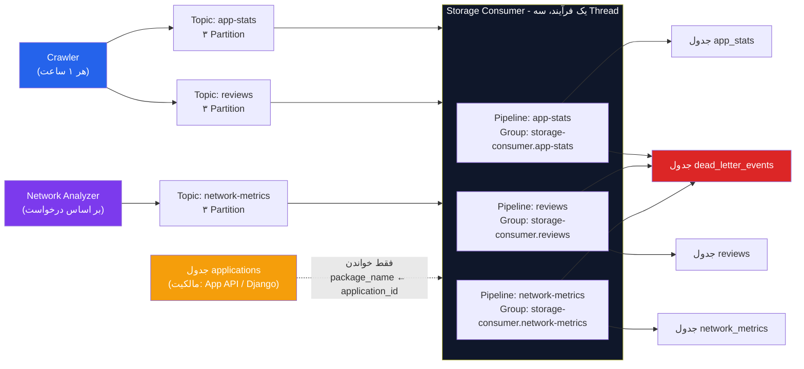
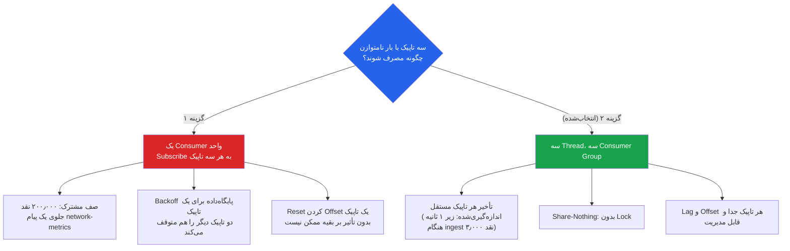
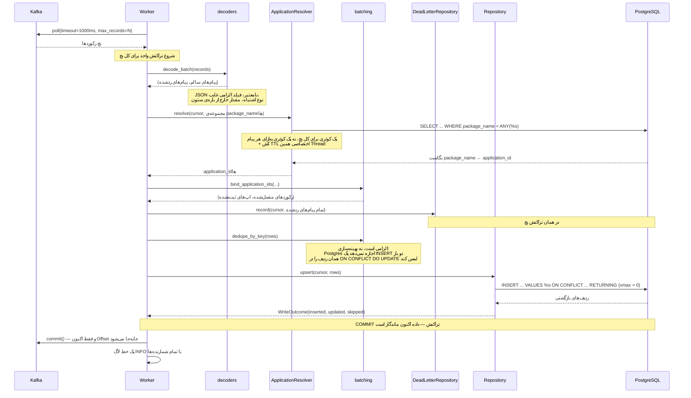
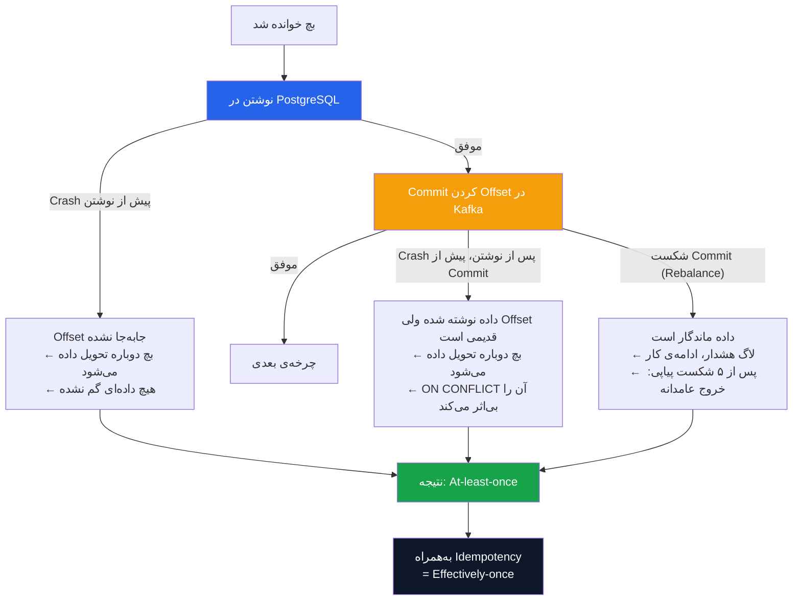
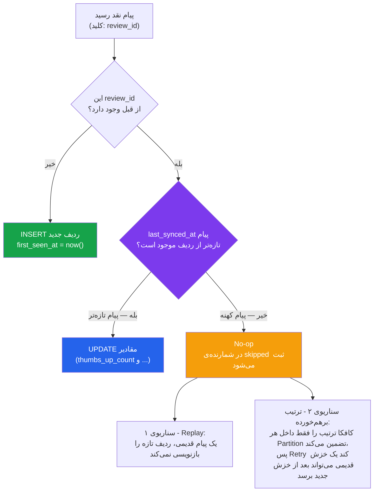
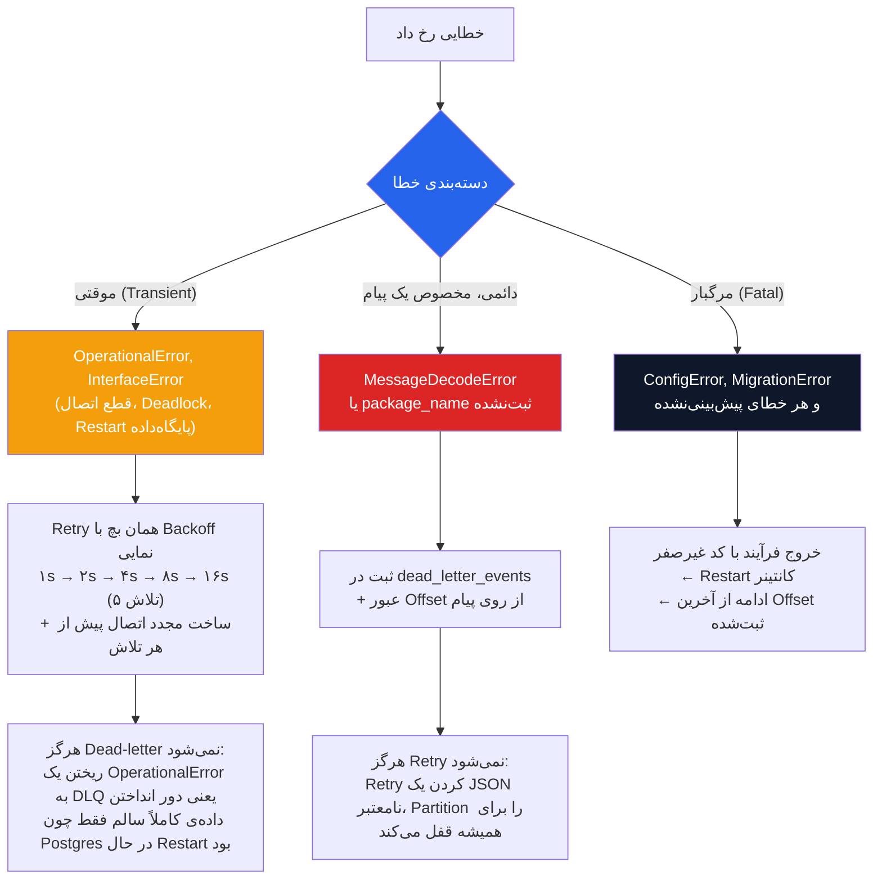
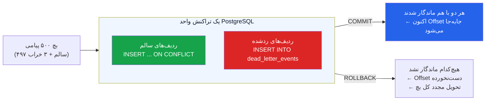
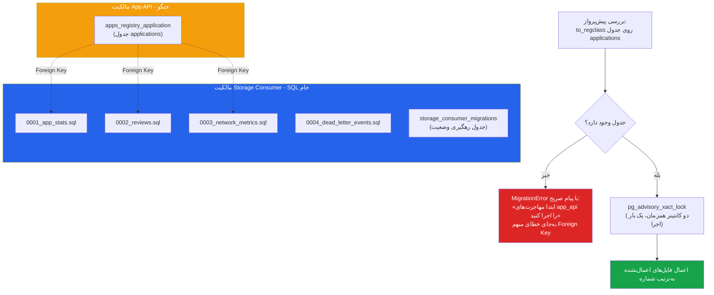
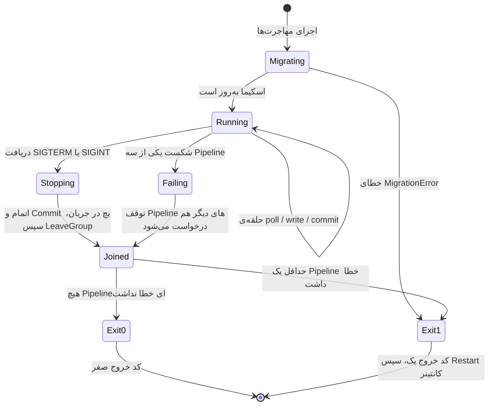
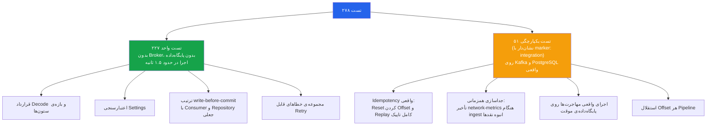

<b>زیرسیستم ذخیره‌سازی (Storage Consumer)</b>

 

این مستند معماری، فلوی اجرا، تضمین‌های داده‌ای و تصمیمات مهندسی زیرسیستم Storage Consumer را شرح می‌دهد. این زیرسیستم سه تاپیک <code>app-stats</code>، <code>reviews</code> و <code>network-metrics</code> را از Kafka مصرف می‌کند و آن‌ها را در PostgreSQL می‌نویسد. نقش آن در پروژه یک نقش ویژه است: <b>این تنها نقطه‌ای است که داده‌ی پروژه از حالت «در حال عبور» به حالت «ماندگار و قابل کوئری» تبدیل می‌شود.</b>

 

همین یک جمله، تفاوت سطح سخت‌گیری این زیرسیستم با بقیه را توضیح می‌دهد. اگر Crawler وسط کار Crash کند، همان اپ در دور بعدی دوباره خزش می‌شود و چیزی از دست نمی‌رود. اگر Network Analyzer شکست بخورد، همان فایل pcap دوباره تحلیل می‌شود. اما اگر Storage Consumer یک پیام را از دست بدهد، آن داده <b>برای همیشه</b> رفته است. تمام پیچیدگی‌های این مستند — Commit دستی Offset، کلیدهای Idempotency، تراکنش واحد، و صف پیام‌های مرده — پاسخ مستقیم همین یک نیازمندی هستند.

<b>۱. چهار تضمین اصلی زیرسیستم</b>

 

پیش از هر جزئیات فنی، کل طراحی این زیرسیستم را می‌توان در چهار تضمین خلاصه کرد. هر تصمیم مهندسی در ادامه‌ی این مستند، در خدمت یکی از این چهار مورد است.

<table dir="rtl" align="right" style="width:100%; text-align:right; border-collapse:collapse;" border="1">
<tr>
<th>تضمین</th>
<th>مکانیزم تحقق</th>
<th>چه چیزی را غیرممکن می‌کند</th>
</tr>
<tr>
<td><b>هیچ پیام منتشرشده‌ای از دست نمی‌رود</b></td>
<td>Offset فقط <b>پس از</b> Commit موفق PostgreSQL جابه‌جا می‌شود (<code>enable_auto_commit=False</code>)</td>
<td>پیامی که خوانده شده اما نوشته نشده، هرگز به‌عنوان «پردازش‌شده» علامت نمی‌خورد</td>
</tr>
<tr>
<td><b>تحویل مجدد، داده را تکراری نمی‌کند</b></td>
<td>هر جدول یک <code>UNIQUE</code> روی کلید طبیعی پیام دارد و هر نوشتن یک <code>INSERT ... ON CONFLICT</code> است</td>
<td>تبدیل At-least-once کافکا به Effectively-once در سطح پایگاه‌داده</td>
</tr>
<tr>
<td><b>یک پیام خراب، کل تاپیک را متوقف نمی‌کند</b></td>
<td>پیام غیرقابل‌ذخیره در جدول <code>dead_letter_events</code> ثبت می‌شود و Offset از رویش عبور می‌کند</td>
<td>قفل‌شدن ابدی یک Partition روی یک پیام معیوب (Poison Pill)</td>
</tr>
<tr>
<td><b>یک Pipeline نیمه‌جان، یعنی فرآیند مرده</b></td>
<td>شکست هر Thread، تمام Threadهای دیگر را متوقف و فرآیند را با کد خروج غیرصفر خارج می‌کند</td>
<td>کانتینری که Uptime سالم نشان می‌دهد در حالی که یکی از سه تاپیک بی‌صدا مصرف نمی‌شود</td>
</tr>
</table>

<b>۲. جایگاه زیرسیستم در معماری کل پروژه</b>

 

این زیرسیستم انتهای زنجیره‌ی جمع‌آوری داده و ابتدای زنجیره‌ی تحلیل است. دو تولیدکننده‌ی مستقل (Crawler و Network Analyzer) روی سه تاپیک پیام می‌نویسند، و این زیرسیستم هر سه را به چهار جدول تحت مالکیت خودش تبدیل می‌کند.

<b>۳. تصمیم معماری کلیدی: چرا سه Thread و نه یک Consumer واحد؟</b>

 

یک Consumer واحد می‌توانست به هر سه تاپیک Subscribe کند و کد ساده‌تری داشته باشد. این گزینه عمداً رد شد، و دلیل آن <b>هیچ ارتباطی به سرعت ندارد</b> — به «انصاف در تأخیر» مربوط است.

 

حجم بار این سه تاپیک به‌شدت نامتوازن است. تاپیک <code>reviews</code> یک مسئله‌ی توان عملیاتی است: در هر دور خزش تا ۲۰۰٫۰۰۰ پیام در بازه‌ی ۵ تا ۱۵ دقیقه منتشر می‌شود. در مقابل، <code>network-metrics</code> یک مسئله‌ی تأخیر است: روزی چند پیام، اما درست در لحظه‌ای که کاربر یک تست شبکه اجرا کرده و منتظر دیدن نتیجه است. با یک Consumer واحد، آن چند پیام حساس به تأخیر پشت صف ۲۰۰٫۰۰۰ پیامی نقدها می‌ماندند و دقیقه‌ها معطل می‌شدند.

 

پس Thread در این طراحی ابزار <b>جداسازی (Isolation)</b> است، نه ابزار افزایش سرعت. هر Pipeline حلقه‌ی Poll مستقل، Consumer Group مستقل، اتصال پایگاه‌داده‌ی مستقل و کش مستقل خودش را دارد. نتیجه‌ی جانبی این تصمیم بسیار مهم است: چون هیچ‌چیز بین Threadها مشترک نیست (به‌جز تنظیمات Immutable و یک رخداد توقف)، <b>در کل این زیرسیستم حتی یک Lock هم وجود ندارد</b>.

<table dir="rtl" align="right" style="width:100%; text-align:right; border-collapse:collapse;" border="1">
<tr>
<th>Pipeline</th>
<th>جدول مقصد</th>
<th>اندازه‌ی بچ (<code>max_poll_records</code>)</th>
<th>ماهیت مسئله</th>
</tr>
<tr>
<td><code>app-stats</code></td>
<td><code>app_stats</code></td>
<td>۲۰۰</td>
<td>حجم متوسط و منظم؛ یک پیام به‌ازای هر اپ در هر دور</td>
</tr>
<tr>
<td><code>reviews</code></td>
<td><code>reviews</code></td>
<td>۵۰۰</td>
<td>توان عملیاتی؛ انبوه پیام در بازه‌ی کوتاه، بچ بزرگ‌تر بهینه‌تر است</td>
</tr>
<tr>
<td><code>network-metrics</code></td>
<td><code>network_metrics</code></td>
<td>۵۰</td>
<td>تأخیر؛ بهتر است هرچه دارد را بنویسد تا منتظر پر شدن بچ بماند</td>
</tr>
</table>

<b>۴. فلوی کامل پردازش یک بچ</b>

 

قلب این زیرسیستم یک حلقه‌ی کوتاه است: <code>poll</code> → پردازش → <code>commit</code>. آنچه این حلقه را کوتاه نگه می‌دارد یک قاعده است: <b>هیچ حالتی (State) از یک Poll به Poll بعدی منتقل نمی‌شود.</b> نتیجه‌ی این قاعده آن است که Rebalance شدن Consumer Group در میانه‌ی یک بچ به‌طور خودکار بی‌خطر است — بچ در جریان، نانوشته رها می‌شود و به هر عضوی که Partition را تحویل بگیرد دوباره تحویل داده می‌شود.

<b>۵. ترتیب حیاتی: نوشتن پیش از Commit</b>

 

مهم‌ترین خط این زیرسیستم، ترتیب دو عملیات است. <code>enable_auto_commit</code> عمداً خاموش است، چون Commit خودکار بر پایه‌ی زمان کار می‌کند نه بر پایه‌ی موفقیت نوشتن — یعنی می‌تواند Offset پیامی را جابه‌جا کند که هنوز در پایگاه‌داده ننشسته است. با Commit دستی و پس از نوشتن، تنها حالت خرابی ممکن، <b>تحویل مجدد</b> است، و تحویل مجدد به‌لطف قیدهای <code>UNIQUE</code> بی‌خطر است.

 

نکته‌ی مهم درباره‌ی شکست Commit: شکست Commit به‌خودی‌خود بی‌خطر است (داده از قبل ماندگار شده و تحویل مجدد بی‌اثر است)، پس این حالت لاگ می‌شود و کار ادامه پیدا می‌کند. اما اگر Commit هرگز موفق نشود، Pipeline تا ابد همان رکوردها را بازپردازش می‌کند در حالی که Lag هیچ‌وقت کاهش نمی‌یابد. این حالت <code>Livelock</code> بسیار سخت‌تر از یک Crash تشخیص داده می‌شود، پس عمداً به Crash تبدیل شده است: پس از ۵ شکست پیاپی، فرآیند با خطا خارج می‌شود تا کانتینر Restart شود.

<b>۶. Idempotency: کلید طبیعی هر جدول</b>

 

کافکا تحویل At-least-once می‌دهد؛ تبدیل آن به Effectively-once وظیفه‌ی این زیرسیستم است. مکانیزم، یک قید <code>UNIQUE</code> روی «کلید طبیعی» هر پیام است، به‌همراه یک <code>INSERT ... ON CONFLICT</code> متناسب با معنای همان جدول. انتخاب بین <code>DO NOTHING</code> و <code>DO UPDATE</code> در هر جدول یک تصمیم معنایی است، نه سلیقه‌ای.

<table dir="rtl" align="right" style="width:100%; text-align:right; border-collapse:collapse;" border="1">
<tr>
<th>جدول</th>
<th>کلید Idempotency</th>
<th>رفتار در تعارض</th>
<th>استدلال</th>
</tr>
<tr>
<td><code>app_stats</code></td>
<td><code>(application_id, crawled_at)</code></td>
<td><code>DO NOTHING</code></td>
<td>هر پیام با همان جفت کلید، طبق تعریف یک تحویل مجدد است — Crawler برای هر اپ در هر دور یک پیام با <code>crawled_at</code> دقیق (میکروثانیه) می‌فرستد، پس چیز تازه‌تری در پیام دوم نیست. خزش بعدی <code>crawled_at</code> جدید دارد و ردیف جدید می‌سازد؛ همین است که جدول را Append-Only نگه می‌دارد.</td>
</tr>
<tr>
<td><code>reviews</code></td>
<td><code>(review_id)</code></td>
<td><code>DO UPDATE</code> با نگهبان یکنوا</td>
<td>تنها جدولی که واقعاً به‌روزرسانی می‌شود، چون <code>thumbs_up_count</code> یک نقد در طول زمان تغییر می‌کند. اما به‌روزرسانی بی‌قید و شرط خطرناک است (بخش بعد).</td>
</tr>
<tr>
<td><code>network_metrics</code></td>
<td><code>(analysis_id)</code></td>
<td><code>DO NOTHING</code></td>
<td>یک فایل pcap یک‌بار تحلیل می‌شود؛ همان <code>analysis_id</code> برای بار دوم یعنی تحویل مجدد، نه اصلاح. اجرای واقعی مجدد یک تست، UUID تازه و در نتیجه ردیف تازه تولید می‌کند.</td>
</tr>
<tr>
<td><code>dead_letter_events</code></td>
<td><code>(topic, partition, kafka_offset)</code></td>
<td><code>DO NOTHING</code></td>
<td>مختصات یک رکورد در کافکا، هویت آن است. Replay یک Partition همان پیام‌های خراب را دوباره رد می‌کند و این نباید ردیف‌ها را چند برابر کند.</td>
</tr>
</table>

<b>۷. نگهبان یکنوا روی جدول reviews</b>

 

جدول <code>reviews</code> تنها جدولی است که به‌روزرسانی می‌شود، و همین آن را در معرض دو خرابی واقعی قرار می‌دهد که هر دو با یک شرط <code>WHERE</code> حل شده‌اند. عبارت به‌کاررفته چنین است:

 

<code>ON CONFLICT (review_id) DO UPDATE SET ... WHERE EXCLUDED.last_synced_at &gt; reviews.last_synced_at</code>

 

دو ستون هم عمداً از فهرست <code>DO UPDATE SET</code> غایب هستند:

<ul>

<li><b><code>first_seen_at</code>:</b> مقدار <code>DEFAULT now()</code> خودش را از لحظه‌ی Insert نگه می‌دارد، تا معنایش «اولین بار که این نقد را دیدیم» بماند، مهم نیست چند بار بعد از آن همگام‌سازی مجدد شود.</li>
 

<li><b><code>sentiment</code>:</b> این ستون به زیرسیستم آینده‌ی <code>sentiment/</code> تعلق دارد. دست زدن به آن در اینجا یعنی هر بار که Crawler یک نقد را دوباره می‌خواند، نتیجه‌ی تحلیل احساسات محاسبه‌شده پاک شود.</li>

</ul>

<b>۸. تفکیک سه‌گانه‌ی خطاها</b>

 

اشتباه گرفتن این سه دسته با هم، دقیقاً همان جایی است که یک Consumer کافکا یا داده از دست می‌دهد یا تا ابد قفل می‌شود. به همین دلیل این تفکیک در کد صریح و آزمون‌شده است.

 

یک نکته‌ی طراحی: خطاهای موقتی <b>عمداً هیچ کلاس اختصاصی در این زیرسیستم ندارند</b>. آن‌ها همان <code>psycopg2.OperationalError</code> و <code>kafka.errors.KafkaError</code> اصلی باقی می‌مانند. بسته‌بندی‌کردن‌شان در یک Exception داخلی، فقط تشخیص «کدام مجموعه Retry می‌شود» را سخت‌تر می‌کرد.

<b>۹. صف پیام‌های مرده در همان تراکنش</b>

 

پیامی که هرگز قابل ذخیره نیست (JSON نامعتبر، فیلد هویتی غایب، یا <code>package_name</code> ثبت‌نشده) در جدول <code>dead_letter_events</code> ثبت می‌شود. نکته‌ی کلیدی این طراحی، <b>محل Commit</b> است: این ثبت در همان تراکنشی انجام می‌شود که داده‌های سالم همان بچ در آن نوشته می‌شوند.

 

این همان خصوصیتی است که یک تاپیک DLQ در کافکا نمی‌توانست بدهد: با تراکنش واحد، <b>غیرممکن است</b> که Offset از روی یک پیام خراب عبور کند در حالی که رکورد آن پیام گم شده باشد. اگر تراکنش Rollback شود، هم داده و هم رکورد خطا با هم برمی‌گردند و بچ دوباره تحویل داده می‌شود.

 

جدول <code>dead_letter_events</code> علاوه بر دلیل خطا، <b>خودِ Payload خام</b> را در یک ستون <code>BYTEA</code> نگه می‌دارد (نه <code>TEXT</code>) — دقیقاً به این دلیل که پیامی که به‌خاطر UTF-8 نامعتبر رد شده هم باید قابل ذخیره باشد. Payloadهای بزرگ‌تر از ۶۴ کیلوبایت بریده می‌شوند و این بریدگی در متن دلیل خطا ثبت می‌شود.

 

<b>کنترل حجم لاگ:</b> در سناریوی واقعی (تغییر نام یک فیلد در سمت تولیدکننده، یا Reset یک Group روی Backlog با فرمت قدیمی) ممکن است تمام ۵۰۰ پیام یک بچ با هم رد شوند. یک خط لاگ به‌ازای هر پیام، ۵۰۰ هشدار در هر بچ تولید می‌کرد و همه‌چیز دیگر را در لاگ کانتینر دفن می‌کرد. پس فقط ۵ مورد اول با جزئیات لاگ می‌شوند و بقیه در یک خط خلاصه‌ی گروه‌بندی‌شده بر اساس دلیل جمع می‌شوند. جزئیات کامل هر رد شدن در جدول موجود است، که اصلاً هدف داشتن آن جدول است.

<b>۱۰. حل کلید خارجی: از package_name به application_id</b>

 

پیام‌های هر سه تاپیک <code>package_name</code> حمل می‌کنند، هرگز <code>application_id</code>. این تصمیم عمدی است: تولیدکنندگان (یک Scraper و یک تحلیل‌گر بسته‌های شبکه) نباید هویت پایگاه‌داده را بشناسند. تبدیل این دو به هم، وظیفه‌ی این زیرسیستم است چون <b>مالک اسکیما خودش است</b>.

 

این خواندن مستقیماً از PostgreSQL انجام می‌شود، <b>نه</b> از طریق Endpoint مربوط به App API که دو زیرسیستم دیگر استفاده می‌کنند. استدلال: این زیرسیستم از قبل Credential پایگاه‌داده را دارد، این جست‌وجو یک کوئری روی یک Unique Index است، و گذاشتن یک فراخوانی HTTP روی مسیر داغِ نوشتن، فقط یک نقطه‌ی شکست جدید اضافه می‌کرد بدون هیچ فایده‌ای.

<table dir="rtl" align="right" style="width:100%; text-align:right; border-collapse:collapse;" border="1">
<tr>
<th>تصمیم</th>
<th>مقدار / رفتار</th>
<th>دلیل</th>
</tr>
<tr>
<td>یک کوئری برای کل بچ</td>
<td><code>WHERE package_name = ANY(%s)</code></td>
<td>برای ۵۰۰ نقد یک اپ، تفاوت بین یک Round-trip و ۵۰۰ Round-trip است</td>
</tr>
<tr>
<td>کش اختصاصی هر Thread</td>
<td>TTL پیش‌فرض ۳۰۰ ثانیه</td>
<td>مشترک کردن یک کش بین سه Thread، نیازمند Lock روی هر پیام بود تا در ساعتی یک کوئری صرفه‌جویی شود</td>
</tr>
<tr>
<td>عدم کش کردن نتایج ناموفق</td>
<td>Miss در کش ذخیره نمی‌شود</td>
<td>Negative Caching باعث می‌شد اپی که اپراتور همین حالا ثبت کرده، تا انقضای TTL دیده نشود</td>
</tr>
<tr>
<td>بدون فیلتر <code>is_active</code></td>
<td>اپ غیرفعال هم <code>application_id</code> می‌گیرد</td>
<td>داده‌ای که از قبل تولید شده باید ذخیره شود؛ Soft Delete یک حکم درباره‌ی «چه چیزی را بعداً خزش کن» است، نه درباره‌ی داده‌ی تاریخی</td>
</tr>
<tr>
<td>اپ ثبت‌نشده = Dead Letter</td>
<td>بدون <code>raise</code>، فقط ردشدن همان پیام</td>
<td>قفل کردن Partition تا زمانی که کسی اپ را ثبت کند، ingestion تمام اپ‌های دیگر را هم متوقف می‌کرد</td>
</tr>
</table>

<b>۱۱. مالکیت اسکیما و مهاجرت‌های SQL</b>

 

یک پایگاه‌داده، اما مالکیت جدول‌ها تفکیک‌شده است. جنگو (App API) مالک جدول <code>applications</code> است و این زیرسیستم مالک چهار جدول خودش. این چهار جدول <b>هیچ Model جنگویی ندارند</b> و با فایل‌های شماره‌گذاری‌شده‌ی SQL ساخته می‌شوند.

 

دو نکته‌ی مهم در این طراحی: اول، <code>pg_advisory_xact_lock</code> تضمین می‌کند اگر چند نسخه از کانتینر همزمان بالا بیایند، مهاجرت‌ها فقط یک بار اعمال شوند. دوم، بررسی پیش‌پرواز با <code>to_regclass</code> باعث می‌شود اپراتور پیام «مهاجرت‌های <code>app_api</code> را اجرا کنید» ببیند، نه یک خطای Foreign Key که علتش قابل حدس نیست.

 

همچنین یک نکته‌ی فنی که جنگو آن را پنهان می‌کرد: <b>PostgreSQL به‌ازای یک کلید خارجی به‌طور خودکار Index نمی‌سازد</b> (این کار را جنگو در سطح ORM انجام می‌دهد). چون این چهار جدول Model جنگویی ندارند، Indexهای لازم روی کلیدهای خارجی صریحاً در همین فایل‌های SQL ساخته شده‌اند.

<b>۱۲. لایه‌ی پایداری: یک بچ، یک دستور INSERT</b>

 

هر جدول یک Repository دارد که فقط در سه چیز با بقیه تفاوت دارد: نام جدول، فهرست ستون‌ها، و متن <code>ON CONFLICT</code>. تمام منطق مشترک — تبدیل کل بچ به یک دستور <code>INSERT</code> چندردیفی و شمارش نتیجه — یک‌جا نوشته شده است.

 

Repositoryها <b>هیچ اتصالی به پایگاه‌داده نگه نمی‌دارند</b>؛ Cursor از بیرون (توسط Worker) به آن‌ها داده می‌شود. همین نکته است که اجازه می‌دهد نوشتن داده و ثبت پیام‌های مرده در یک تراکنش واحد قرار بگیرند.

<table dir="rtl" align="right" style="width:100%; text-align:right; border-collapse:collapse;" border="1">
<tr>
<th>جزئیات پیاده‌سازی</th>
<th>توضیح</th>
</tr>
<tr>
<td><code>execute_values</code> با <code>page_size=1000</code></td>
<td>بزرگ‌تر از بزرگ‌ترین <code>max_poll_records</code> (۵۰۰ برای نقدها)، پس یک بچ در حالت معمول یک Round-trip است</td>
</tr>
<tr>
<td><code>RETURNING (xmax = 0) AS inserted</code></td>
<td>Postgres مقدار <code>xmax</code> را برای ردیف تازه Insert شده صفر و برای ردیفی که <code>DO UPDATE</code> جایگزینش کرده غیرصفر می‌گذارد. همین است که به یک خط لاگ اجازه می‌دهد در یک نگاه بگوید «این Backfill است یا وضعیت پایدار»</td>
</tr>
<tr>
<td>شمارنده‌ی <code>skipped</code></td>
<td>ردیف‌هایی که پایگاه‌داده نپذیرفت: تعارض کلید در <code>DO NOTHING</code>، یا به‌روزرسانی‌ای که نگهبان یکنوا رد کرد. مقدار مداوماً غیرصفر یعنی چیزی در حال Replay است</td>
</tr>
<tr>
<td><code>dedupe_by_key</code> پیش از نوشتن</td>
<td>یک الزام است، نه بهینه‌سازی: Postgres یک <code>ON CONFLICT DO UPDATE</code> که دو بار همان ردیف را در یک دستور لمس کند رد می‌کند و کل تراکنش را Abort می‌کند</td>
</tr>
</table>

<b>۱۳. اعتبارسنجی در لحظه‌ی Decode</b>

 

Decoderها فقط ساختار پیام را بررسی نمی‌کنند؛ آن‌ها <b>محدودیت‌های ستون پایگاه‌داده</b> را هم در همان لحظه اعمال می‌کنند: بازه‌ی <code>SMALLINT</code> و <code>INTEGER</code> و <code>BIGINT</code>، طول <code>VARCHAR</code>، معتبر بودن UUID، و مقادیر <code>NaN</code> و <code>Inf</code>.

 

دلیل این سخت‌گیری در جای درست، یک نکته‌ی مهم است: چون کل بچ در یک تراکنش نوشته می‌شود، <b>یک مقدار خارج از بازه که به SQL برسد، تراکنش را برای کل بچ Abort می‌کند</b> — یعنی ۴۹۹ پیام سالم هم قربانی یک پیام معیوب می‌شوند. با گرفتن آن در لحظه‌ی Decode، همان یک پیام به DLQ می‌رود و بقیه سالم نوشته می‌شوند.

 

یک تصمیم مرتبط دیگر: کتابخانه‌ی <code>google-play-scraper</code> فیلد زمانی <code>at</code> را بدون Timezone (Naive) تولید می‌کند، در حالی که تمام ستون‌های زمانی این زیرسیستم <code>TIMESTAMPTZ</code> هستند. سیاست صریح این است که زمان‌های Naive در همین لایه به UTC نسبت داده شوند، تا هیچ ابهامی به پایگاه‌داده نرسد.

<b>۱۴. پیکربندی: Fail-Fast و قابل تنظیم</b>

 

تمام تنظیمات در یک کلاس <code>Settings</code> واحد و <code>frozen</code> جمع شده‌اند که در لحظه‌ی شروع Validate می‌شود. مقدار محیطی نامعتبر، بلافاصله برنامه را با پیام واضح متوقف می‌کند، نه ساعت‌ها بعد وسط یک بچ. این کلاس Immutable و Slotted است چون <b>تنها شیئی است که بین سه Thread مشترک است</b> (به‌جز رخداد توقف) و همین Immutable بودن است که مدل Share-Nothing را بدون Lock ایمن می‌کند.

<table dir="rtl" align="right" style="width:100%; text-align:right; border-collapse:collapse;" border="1">
<tr>
<th>تنظیم</th>
<th>مقدار پیش‌فرض</th>
<th>دلیل انتخاب</th>
</tr>
<tr>
<td><code>enable_auto_commit</code></td>
<td><code>False</code></td>
<td>Commit خودکار بر پایه‌ی زمان است نه موفقیت نوشتن؛ می‌توانست Offset پیامی را جابه‌جا کند که هنوز ننشسته است</td>
</tr>
<tr>
<td><code>auto_offset_reset</code></td>
<td><code>earliest</code></td>
<td>یک Group تازه باید کل Backlog موجود را بخواند، نه اینکه داده‌ی منتشرشده را نادیده بگیرد</td>
</tr>
<tr>
<td><code>poll_timeout_ms</code></td>
<td><code>1000</code></td>
<td>به‌قدر کافی کوتاه که SIGTERM حداکثر یک ثانیه معطل بماند</td>
</tr>
<tr>
<td><code>max_poll_interval_ms</code></td>
<td><code>300000</code> (۵ دقیقه)</td>
<td>سقف زمان پردازش یک بچ پیش از آنکه Broker عضو را مرده فرض کند؛ با احتساب بدترین حالت Retry پایگاه‌داده انتخاب شده</td>
</tr>
<tr>
<td><code>session_timeout_ms</code></td>
<td><code>45000</code></td>
<td>تحمل نوسان شبکه بدون Rebalance بی‌مورد</td>
</tr>
<tr>
<td><code>db_retry_max_attempts</code></td>
<td><code>5</code> با Backoff پایه‌ی ۱ ثانیه</td>
<td>پوشش یک Restart کامل PostgreSQL (۱+۲+۴+۸+۱۶ ثانیه) بدون از دست دادن بچ</td>
</tr>
<tr>
<td><code>application_cache_ttl_seconds</code></td>
<td><code>300</code></td>
<td>تعادل بین کم کردن کوئری و دیده شدن سریع اپ تازه ثبت‌شده</td>
</tr>
<tr>
<td><code>shutdown_timeout_seconds</code></td>
<td><code>30</code></td>
<td>فرصت کافی برای اتمام و Commit بچ در جریان؛ در Compose با <code>stop_grace_period: 45s</code> هم‌راستا شده</td>
</tr>
</table>

 

اندازه‌ی بچ هر Pipeline سه سطح اولویت دارد تا اپراتور بتواند بدون تغییر کد آن را تنظیم کند: متغیر مخصوص همان Pipeline (مثل <code>STORAGE_MAX_POLL_RECORDS_REVIEWS</code>)، سپس متغیر عمومی <code>STORAGE_MAX_POLL_RECORDS</code>، و در نهایت مقدار پیش‌فرض تنظیم‌شده در کد.

<b>۱۵. Supervisor، سلامت و خاموشی تمیز</b>

 

Supervisor یک قاعده را اعمال می‌کند: <b>فرآیند تا زمانی زنده است که تمام Pipelineهایش زنده باشند.</b> کانتینری که با دو Pipeline از سه Pipeline در حال کار باشد، Uptime سالمی نشان می‌دهد در حالی که داده بی‌صدا قطع شده است — و این از Crash کردن بدتر است، چون دیده نمی‌شود.

 

<b>سلامت به‌تفکیک Pipeline (بدون سرور HTTP):</b> هر Worker در هر دور حلقه، فایل مخصوص خودش را <code>touch</code> می‌کند و اسکریپت <code>healthcheck.sh</code> بررسی می‌کند که تمام فایل‌های مورد انتظار تازه باشند. نتیجه این است که کانتینری که Thread نقدهایش گیر کرده، فقط به‌خاطر «در حال اجرا بودن» سالم گزارش نمی‌شود. عمل <code>touch</code> نرخ‌محدود است تا یک حلقه‌ی پرمشغله به یک System Call در هر Poll تبدیل نشود، و هر خطای نوشتن فایل تنها یک بار هشدار می‌دهد و نادیده گرفته می‌شود — پر بودن <code>/tmp</code> یک مشکل مانیتورینگ است و نباید به قطعی ingestion تبدیل شود.

 

<b>خاموشی تمیز:</b> Entrypoint کانتینر با <code>exec</code> اجرا می‌شود تا فرآیند پایتون PID 1 شود و SIGTERM را مستقیماً دریافت کند (نه اینکه یک Shell آن را ببلعد). سیگنال در مرز Poll دیده می‌شود، بچ در جریان کامل و Commit می‌شود، و سپس Consumer با <code>LeaveGroup</code> از Group خارج می‌شود تا Broker بلافاصله Rebalance کند به‌جای انتظار برای انقضای کامل Session — در یک Rolling Restart این تفاوت میان چند ثانیه و نزدیک یک دقیقه ingestion متوقف است.

<b>۱۶. استراتژی تست</b>

 

مجموعه‌ی تست‌ها به دو بخش تقسیم می‌شود، و این تقسیم مستقیماً از یک تصمیم معماری می‌آید: هسته‌ی زیرسیستم (<code>config</code>، <code>events</code>، <code>decoders</code>، <code>batching</code>، <code>retry_policy</code>) عمداً <b>نه Kafka می‌شناسد و نه psycopg2</b>. همین است که اجازه می‌دهد قرارداد داده‌ی هر سه تاپیک بدون بالا آوردن هیچ سرویسی آزمون شود.

 

تست‌های یکپارچگی همه‌ی تاپیک‌ها و اپ‌های مورد نیاز خودشان را می‌سازند و پس از پایان پاک می‌کنند، پس اجرای آن‌ها روی یک Stack فعال بی‌خطر است. اگر Kafka یا PostgreSQL در دسترس نباشند، این تست‌ها به‌جای شکست، Skip می‌شوند تا مجموعه روی ماشینی بدون کانتینر هم سبز بماند.

<b>۱۷. عملیات: تأیید، Replay و مقیاس‌دهی</b>

 

سه عملیات روزمره‌ی این زیرسیستم به‌صورت صریح مستند و ابزارمند شده‌اند.

<table dir="rtl" align="right" style="width:100%; text-align:right; border-collapse:collapse;" border="1">
<tr>
<th>عملیات</th>
<th>روش</th>
<th>نکته‌ی مهم</th>
</tr>
<tr>
<td>تأیید سلامت استقرار</td>
<td>اسکریپت <code>scripts/verify/verify_storage_consumer.sh</code></td>
<td>کل مسیر را به‌ترتیب بررسی می‌کند: نسخه‌ی اسکیما، تعداد Partition تاپیک‌ها، پیام‌های تولیدشده، ردیف‌های نوشته‌شده، پیام‌های مرده، و Lag هر Group — پس شکست، مرحله‌ی خراب را نشان می‌دهد نه کل Pipeline را</td>
</tr>
<tr>
<td>Replay یک تاپیک</td>
<td>Reset کردن Offset همان Consumer Group به <code>earliest</code></td>
<td>چون هر تاپیک Group مستقل دارد، می‌توان <code>reviews</code> را برای بازسازی کامل جدولش Replay کرد <b>بدون</b> اینکه <code>app-stats</code> هم دوباره پردازش شود. Idempotency باعث می‌شود این کار داده را تکراری نکند</td>
</tr>
<tr>
<td>مقیاس‌دهی یک Pipeline</td>
<td>اجرای نسخه‌ی دوم کانتینر با <code>STORAGE_PIPELINES</code> مخصوص همان Pipeline</td>
<td>چون هر تاپیک ۳ Partition دارد، تا ۳ عضو فعال در هر Group پشتیبانی می‌شود. همین متغیر اجازه می‌دهد همان Image به‌صورت سه کانتینر تک‌Pipeline با Restart Policy مستقل هم اجرا شود، بدون تغییر کد</td>
</tr>
</table>

 

<b>یک نکته‌ی مهم برای اولین استقرار:</b> تمام پیام‌هایی که همین حالا روی تاپیک‌های <code>app-stats</code> و <code>reviews</code> نشسته‌اند، از قبل از تثبیت قرارداد فعلی فیلدها هستند (ساختار خام camelCase کتابخانه). این پیام‌ها طبق طراحی به <code>dead_letter_events</code> می‌روند. این یک باگ نیست؛ در اولین استقرار باید این Backlog قدیمی را رد کرد (Reset کردن Offset به <code>latest</code>) یا تاپیک‌ها را پاک کرد.

<b>۱۸. تصمیمات کلیدی دیگر</b>

 

<ul>

<li><b>یک Consumer Group به‌ازای هر تاپیک، نه یک Group برای هر سه:</b> Groupهای جدا همان چیزی هستند که اجازه می‌دهند اپراتور <code>reviews</code> را برای بازسازی جدولش Reset کند بدون Replay شدن <code>app-stats</code>، و همان چیزی که Lag هر تاپیک را در kafka-ui جداگانه قابل مشاهده می‌کند.</li>
 

<li><b>ساخت تاپیک با سه Partition از ابتدا:</b> تاپیک ساخته‌شده به‌صورت خودکار فقط یک Partition دارد، و این سقف هر Consumer Group را برای همیشه روی یک عضو فعال قفل می‌کند. تعداد Partition یک تاپیک قابل کاهش نیست، پس فهمیدن این موضوع زیر بار، یعنی بازسازی تاپیک؛ ساختن آن‌ها از ابتدا تنها لحظه‌ی ارزان برای درست انجام دادنش است.</li>
 

<li><b>Repositoryها بدون اتصال و بدون State:</b> Cursor از بیرون تزریق می‌شود تا نوشتن به تراکنش بچ ملحق شود، نه اینکه تراکنش خودش را باز کند. همین یک تصمیم است که تراکنش واحد داده و DLQ را ممکن کرده است.</li>
 

<li><b>تفکیک <code>.env</code> هاست از مقادیر Docker:</b> فایل <code>storage_consumer/.env</code> فقط برای اجرای مستقل روی هاست است (<code>localhost:9092</code> و <code>127.0.0.1</code>)، در حالی که سرویس در Compose به <code>kafka:29092</code> و <code>postgres</code> نیاز دارد. این زیرسیستم روشن‌ترین نمونه‌ی این تفکیک در کل پروژه است، چون تنها زیرسیستمی است که <b>هم</b> به Kafka و <b>هم</b> به PostgreSQL وصل می‌شود و در نتیجه هر دو دسته آدرس را دارد.</li>
 

<li><b>تکرار عامدانه‌ی <code>retry_policy</code>:</b> این فایل نسخه‌ی مستقلی از همتای خود در <code>crawler/</code> و <code>network_analyzer/</code> است، چون هر زیرسیستم یک واحد استقرار مستقل با Image و <code>requirements.txt</code> خودش است و سورس بقیه در Image آن حاضر نیست. آنچه <b>واقعاً متفاوت</b> است، مجموعه‌ی خطاهای قابل Retry است: دو زیرسیستم دیگر HTTP را Retry می‌کنند، این یکی پایگاه‌داده را.</li>

</ul>

<b>۱۹. ابزارها و تکنولوژی‌های استفاده‌شده</b>

 

<table dir="rtl" align="right" style="width:100%; text-align:right; border-collapse:collapse;" border="1">
<tr>
<th>ابزار</th>
<th>نقش</th>
</tr>
<tr>
<td>kafka-python (KafkaConsumer)</td>
<td>مصرف پیام از سه تاپیک با Commit دستی Offset و مدیریت Consumer Group</td>
</tr>
<tr>
<td>psycopg2</td>
<td>اتصال به PostgreSQL و اجرای <code>INSERT</code> چندردیفی با <code>execute_values</code></td>
</tr>
<tr>
<td>threading (stdlib)</td>
<td>یک Thread به‌ازای هر Pipeline، به‌همراه رخداد توقف مشترک برای خاموشی هماهنگ</td>
</tr>
<tr>
<td>SQL خام + جدول رهگیری مهاجرت</td>
<td>مالکیت اسکیمای چهار جدول این زیرسیستم، مستقل از مهاجرت‌های جنگو</td>
</tr>
<tr>
<td>dataclasses (frozen, slots)</td>
<td>تنظیمات و رخدادهای Immutable که بین Threadها بی‌خطر مشترک می‌شوند</td>
</tr>
<tr>
<td>python-dotenv</td>
<td>بارگذاری پیکربندی محیطی در حالت اجرای مستقل (venv)</td>
</tr>
<tr>
<td>pytest (با marker جداگانه‌ی integration)</td>
<td>تفکیک تست‌های بدون سرویس از تست‌هایی که به Kafka و PostgreSQL واقعی نیاز دارند</td>
</tr>
<tr>
<td>Docker Healthcheck + فایل‌های Heartbeat</td>
<td>سنجش سلامت به‌تفکیک هر Pipeline، بدون نیاز به بالا آوردن یک سرور HTTP</td>
</tr>
</table>

