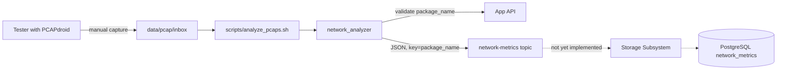

# Network Information Extraction Subsystem

Analyzes application network traffic captured with [PCAPdroid](https://emanuele-f.github.io/PCAPdroid/),
computes the network quality and data-efficiency metrics required by the project
specification, and publishes one result message per capture file to Kafka.

## Why this subsystem does not write to PostgreSQL

The specification assigns database persistence to the Data Storage Subsystem:

> "Additionally, this component is responsible for persisting the network
> information extracted by the previous subsystem into the database."

So the analyzer publishes to the `network-metrics` Kafka topic and never opens a
database connection. Beyond following the requirement, this keeps exactly one
component in the system holding PostgreSQL credentials and owning migrations —
two independently deployed services coupled to one physical schema would need a
coordinated release for every schema change.

Two consequences worth knowing:

- The analysis core (`analysis/`) is a pure function from capture bytes to
  metrics. It imports no Kafka, HTTP, or database client, which is what makes it
  testable against synthetic captures with known ground truth.
- Because manual captures are expensive to reproduce, the Kafka log doubles as a
  durable record of every computed result. A bug found later in the consumer's
  mapping is fixed by resetting offsets, not by re-capturing traffic on a phone.



## Kafka message contract

This section is the interface the Data Storage Subsystem will implement against.

- **Topic:** `network-metrics`
- **Key:** `package_name`, UTF-8 encoded
- **Value:** JSON, UTF-8 encoded, snake_case keys, no envelope wrapper

Matching the crawler's conventions in [`crawler/kafka_producer.py`](../crawler/kafka_producer.py):
the key is the package name so every record for one application lands in one
partition, and the value is a flat object rather than a `{type, payload}`
envelope.

```json
{
  "analysis_id": "8f14e45f-ea6a-4f2b-9c1d-2b3a5c7d9e01",
  "package_name": "com.whatsapp",
  "scenario": "UPLOAD",
  "rtt_handshake": 43.12,
  "retransmission_count": 7,
  "zero_window_count": 0,
  "tcp_reset_count": 2,
  "bytes_transferred_total": 18234123,
  "bytes_payload_total": 17540221,
  "overhead_ratio": 0.038,
  "source_pcap_filename": "com.whatsapp__upload__20260907T141500.pcap",
  "analyzed_at": "2026-09-07T14:20:11+00:00"
}
```

| Field | Type | Notes |
| --- | --- | --- |
| `analysis_id` | string (UUID4) | Idempotency key. See below. |
| `package_name` | string | Resolved to `application_id` by the consumer. |
| `scenario` | string | `UPLOAD` or `DOWNLOAD`. |
| `rtt_handshake` | float \| null | Milliseconds. `null` when the capture holds no complete handshake. |
| `retransmission_count` | int | TCP only. |
| `zero_window_count` | int | TCP only. |
| `tcp_reset_count` | int | TCP only. |
| `bytes_transferred_total` | int | All IP traffic. |
| `bytes_payload_total` | int | All IP traffic. |
| `overhead_ratio` | float | `0.0`–`1.0`. |
| `source_pcap_filename` | string | Filename only, no directory path. |
| `analyzed_at` | string | ISO 8601 with UTC offset. |

The payload maps onto the `network_metrics` table documented in
[`docs/raw_md/database_schema.md`](../docs/raw_md/database_schema.md), with two
deliberate differences:

**`analysis_id` is new.** Kafka delivery is at-least-once and the table has no
unique constraint, so a redelivered message would silently create a duplicate
row. A UUID generated per analyzed file, with a unique constraint on the column,
lets the consumer use `get_or_create` and makes redelivery harmless. This
preserves the append-only intent recorded in the schema document: genuinely
re-running a test produces a new UUID and therefore a new row.

**`analyzed_at` is stamped by the analyzer**, carried in the payload, and written
verbatim by the consumer rather than left to Django's `auto_now_add`. Otherwise
the column would record when the consumer happened to read the message, not when
the analysis ran.

The analyzer sends `package_name`, never `application_id`. Foreign-key
resolution belongs to the component that owns the schema, which keeps database
identity out of a subsystem whose job is packet arithmetic.

## Metric definitions

Three of the metrics are exact reads of protocol fields, one is an average over
matched packet pairs, and one relies on a documented heuristic. Knowing which is
which matters when interpreting results.

### Group 1 — network quality and stability (TCP only)

**Handshake RTT** (`rtt_handshake`, ms) — the mean of `t(SYN-ACK) − t(SYN)` over
every handshake in the file. A SYN is indexed by its flow direction and sequence
number; the matching SYN-ACK is the packet on the reversed direction whose
acknowledgement number is `seq + 1`. `null` when the capture contains no
complete handshake, which happens when the connection was already established
before recording started — the schema column is nullable for exactly this case.

When a SYN is lost and retransmitted, the measurement runs from the *first*
SYN, so it includes the retransmission timeout. The specification asks for the
time between "sending the initial connection setup packet and receiving its
acknowledgment", and a connection that took three seconds to establish should
report three seconds rather than the 20 ms round trip of the attempt that
finally got through. Wireshark's `tcp.analysis.ack_rtt` behaves the same way,
which the oracle test verifies.

**Retransmission count** (`retransmission_count`) — *heuristic.* Per flow
direction, the analyzer tracks the highest `seq + payload_length` observed. A
segment carrying payload whose `seq + payload_length` does not exceed that
high-water mark counts as a retransmission; an exactly duplicated SYN or FIN
counts too. This does not distinguish true retransmissions from out-of-order
delivery or spurious retransmissions the way Wireshark's expert analysis does,
which is why the test suite includes an optional oracle test comparing the
analyzer's output against `tshark`.

**Zero-window count** (`zero_window_count`) — exact. TCP packets advertising
`window == 0`, excluding SYN and RST packets. A SYN's window is an initial
advertisement rather than a buffer-full notification, and a RST's window field
is meaningless.

**TCP reset count** (`tcp_reset_count`) — exact. Packets with the RST flag set.

### Group 2 — data consumption efficiency (all IP traffic)

**Total bytes transferred** (`bytes_transferred_total`) — the sum of each
packet's IP-header length field, not the capture record length. This is a
deliberate choice, explained under "PCAPdroid capture formats" below.

**Total payload bytes** (`bytes_payload_total`) — layer-4 payload only. TCP
contributes `ip_total_length − ip_header_length − tcp_header_length` (accounting
for options in both headers), UDP contributes `udp_length − 8`, and every other
protocol contributes nothing.

**Overhead ratio** (`overhead_ratio`) — `(total − payload) / total`, i.e. header
volume as a fraction of all traffic. Computed as a derived property of the two
byte totals so it can never contradict them, and `0.0` for an empty capture
where the ratio is undefined.

### Interpreting the numbers

Group 1 covers TCP only while group 2 covers all IP traffic. Modern messaging
applications carry most bulk transfer over QUIC, which is UDP-based, so a
capture can legitimately show large byte totals alongside near-zero
retransmission and zero-window counts. That is an observation about the
application's transport choice, not a parser failure. To exercise the TCP
metrics, capture with QUIC disabled in the application's settings where that is
possible.

## PCAPdroid capture formats

PCAPdroid writes pcap files in one of two shapes, and the reader handles both by
dispatching on the link-layer type in the file header:

| Link type | When | Handling |
| --- | --- | --- |
| `101` (raw IP) | Default, including root mode | Records start at the IP header. |
| `1` (Ethernet) | "PCAPdroid extensions" enabled | Records carry a synthetic Ethernet header plus a trailer holding the originating app's UID and package name. |

The reader compares against these literal link-type numbers rather than dpkt's
`DLT_*` constants, because `dpkt.pcap.Reader.datalink()` returns the value from
the file header while `dpkt.pcap.DLT_RAW` is the platform's BSD-style constant
(`12`, not `101`).

This is why `bytes_transferred_total` sums the IP header's length field instead
of the capture record length. With extensions enabled, PCAPdroid adds roughly
46 bytes per packet of its own bookkeeping — a 14-byte fake Ethernet header,
padding, a 28-byte trailer, and a 4-byte checksum — none of which the
application actually sent. Reading the IP length field yields the same answer in
both capture modes, excludes PCAPdroid's overhead, and is immune to snaplen
truncation.

## Layout

`analysis/` is the pure core: it imports only the domain model, the standard
library, and `dpkt`. Everything that talks to the outside world lives at the
package root.

```
network_analyzer/
├── main.py                 # argparse CLI + composition root
├── config.py               # frozen Settings + load_settings()
├── exceptions.py
├── models.py               # Scenario, TcpSegment, ParsedPacket, NetworkMetrics
├── analyzer_service.py     # use case: validate -> analyze -> publish
├── message_mapper.py       # AnalysisResult -> Kafka JSON (pure)
├── filename_parser.py      # <package>__<scenario>__<timestamp>.pcap
├── app_registry_client.py  # App API eligibility check
├── kafka_publisher.py      # network-metrics producer
├── retry_policy.py         # with_retry, exponential backoff
├── analysis/
│   ├── packet_reader.py    # link-type dispatch, trailer stripping
│   ├── tcp_analyzer.py     # RTT, retransmissions, zero-window, RST
│   ├── volume_analyzer.py  # byte totals
│   └── metrics_calculator.py
└── tests/
```

## Capture file convention

Captures are named so that batch ingestion needs no per-file arguments:

```
<package_name>__<upload|download>__<YYYYMMDDTHHMMSS>.pcap
com.whatsapp__upload__20260907T141500.pcap
```

The separator is a double underscore because both `.` and `_` are legal inside
an Android package name. The timestamp is informational and never reaches the
wire contract — a phone's clock and timezone are not trustworthy enough to
persist as capture time. Both `--package` and `--scenario` override the parsed
values for files that cannot be renamed.

## Recording a capture with PCAPdroid

1. Install PCAPdroid and grant it VPN permission.
2. Set the target application under **Target apps**, so the capture holds only
   that application's traffic.
3. Set **Dump mode** to *PCAP file*.
4. Start the capture, perform exactly one scenario — send a file, or download
   one — then stop it. One scenario per file.
5. Copy the file off the device into `data/pcap/inbox/` and rename it to follow
   the convention above.

Leaving "PCAPdroid extensions" off produces the smaller raw-IP format. Either
setting works; the reader detects which one it is.

## Usage

### Setup

```bash
python -m venv .venv-analyzer
.venv-analyzer/bin/pip install -r network_analyzer/requirements.txt
cp network_analyzer/.env.example network_analyzer/.env   # then edit if needed
```

`network_analyzer/.env` holds host-side connection settings. The container gets
its own values from `docker-compose.yml`, because the hostnames differ
(`localhost:9092` from the host, `kafka:29092` inside the network). Neither file
is needed for a fully offline run — see `--dry-run` below.

### Analyzing one capture

```bash
# Package and scenario come from the filename.
python -m network_analyzer.main --file data/pcap/inbox/com.whatsapp__upload__20260907T141500.pcap

# Override them for a file that cannot be renamed.
python -m network_analyzer.main --file capture.pcap --package com.whatsapp --scenario UPLOAD

# Print the metrics without publishing anything.
python -m network_analyzer.main --file capture.pcap --dry-run

# Fully offline: no broker, no App API, no .env required.
python -m network_analyzer.main --file capture.pcap --dry-run --skip-registry-check
```

Before publishing, the analyzer asks the App API whether the package exists, is
active, and is flagged `is_messaging_app`. That check is what keeps the Kafka
decision honest: a mistyped package name fails on your terminal in a second
instead of surfacing later in a consumer log. `--skip-registry-check` bypasses
it for offline work.

Exit codes matter, because `analyze_pcaps.sh` routes files by them:

| Code | Meaning | What the batch script does |
| --- | --- | --- |
| 0 | Analyzed and published | Moves the capture to `processed/` |
| 1 | Configuration or unexpected error | Moves it to `failed/` with a `.log` |
| 2 | Command-line usage error | Moves it to `failed/` with a `.log` |
| 3 | Bad filename, or ineligible application | Moves it to `failed/` with a `.log` |
| 4 | Not a readable capture | Moves it to `failed/` with a `.log` |
| 5 | Kafka or App API unreachable | **Leaves it in the inbox to retry** |

The split between 5 and the rest is the useful part: an unreachable broker must
not quarantine a perfectly good capture, and a malformed capture must not be
retried forever.

### Batch ingestion — `scripts/analyze_pcaps.sh`

Drop captures into `data/pcap/inbox/` and run:

```bash
./scripts/analyze_pcaps.sh                                    # analyze and publish
./scripts/analyze_pcaps.sh --dry-run --skip-registry-check --keep
./scripts/analyze_pcaps.sh --inbox ~/Downloads/PCAPdroid      # analyze elsewhere
./scripts/analyze_pcaps.sh --help
```

Each capture is analyzed, then filed by exit code per the table above, leaving
an on-disk audit trail. Reruns are therefore idempotent: a successful capture
has already left the inbox, so nothing is analyzed twice, and no cron job or
state file is needed to track progress.

Options: `--inbox`, `--processed`, `--failed`, `--python`, `--dry-run`,
`--skip-registry-check`, `--keep` (analyze in place, move nothing), `--verbose`.
The interpreter is auto-detected from `$ANALYZER_PYTHON`, then a project
virtualenv, then `python3`, and the script fails early with an install hint if
the one it picks lacks the dependencies.

Exits 0 when every capture was analyzed or the inbox was empty, 1 when anything
failed or still needs a retry.

### Verifying publication — `scripts/verify_network_metrics.sh`

The Data Storage Subsystem does not exist yet, so there are no database rows to
check and the topic is the only evidence that a message landed:

```bash
./scripts/verify_network_metrics.sh                  # replay the topic
./scripts/verify_network_metrics.sh --count-only     # just the message count
./scripts/verify_network_metrics.sh --latest --max-messages 1 --timeout 60
```

It checks that the broker is up and the topic exists, reports how many records
it holds, then pretty-prints them with their Kafka keys. Options: `--max-messages`,
`--timeout`, `--latest`, `--count-only`, `--topic`, `--container`.

### Running in Docker

The compose service sits behind the `tools` profile, so `docker compose up`
never starts it — this is an on-demand batch job, not a daemon:

```bash
docker compose --profile tools build network-analyzer

docker compose run --rm network-analyzer \
  --file /data/pcap/inbox/com.whatsapp__upload__20260907T141500.pcap
```

`./data/pcap` is bind-mounted to `/data/pcap` in the container, since captures
are copied off a phone by hand and need to be reachable from the host.

**Known limitation.** From inside the container the App API is reached at
`http://host.docker.internal:8000`, but `app_api/config/settings.py` currently
sets `ALLOWED_HOSTS = []`, so Django answers that hostname with HTTP 400 and the
registry check fails. Until the App API becomes a compose service, either add
`host.docker.internal` to `ALLOWED_HOSTS`, or run the container with
`--skip-registry-check` and rely on the host-side run for validation. The same
constraint applies to the crawler container. The analyzer reports this case as a
configuration error rather than a retryable one, so a batch run fails loudly
instead of looping.

## Testing

```bash
python -m pytest network_analyzer/tests/ -q -m "not live and not oracle"
```

Analysis tests build synthetic captures in-process with `scapy`, injecting an
exact known number of retransmissions, zero-window advertisements, and resets,
then asserting the analyzer reports precisely those counts. No binary fixtures
are committed and the tests are fully deterministic.

Two marked suites are excluded from normal runs:

```bash
# Compare metrics against Wireshark's expert analysis. Needs tshark installed.
python -m pytest network_analyzer/tests/ -q -m oracle

# Publish to a real broker and read the message back. Needs Kafka running.
python -m pytest network_analyzer/tests/ -q -m live
```
